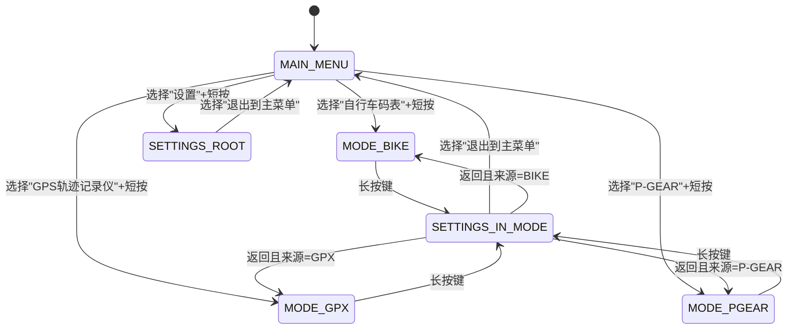
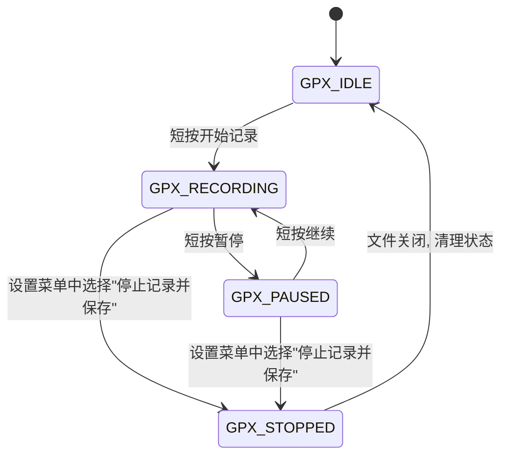
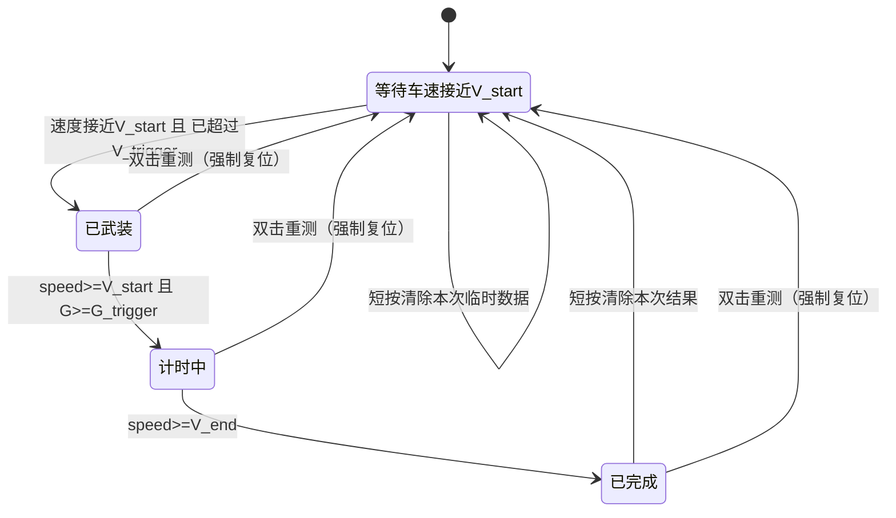
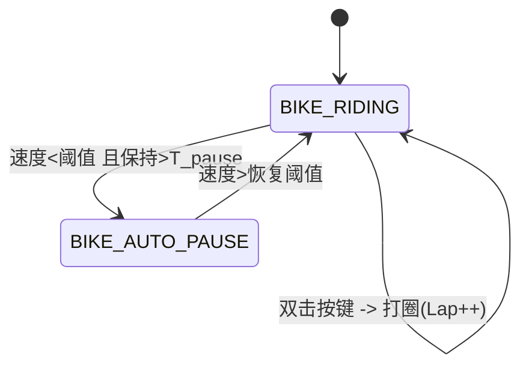
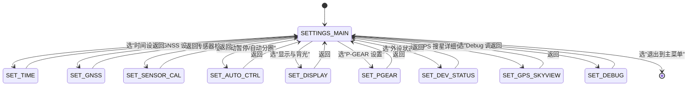

下面是合并你确认的 53 条修改意见后的 **完整 SRS v1.2**，已经把之前 v1.1 的内容全部更新进去，适合作为“AI 生成代码”的唯一规范文档。

---

# ESP32S3 三合一设备

## 软件需求规格书（SRS）v1.2

---

## 0. 概述

* **设备功能集：**

  1. 自行车码表（Bike Computer）
  2. GPS 轨迹记录仪（GPX Recorder）
  3. P-GEAR 汽车 0–100 加速测试

* **硬件平台：**

  * SoC：ESP32-S3FH4R2（4MB Flash，2MB PSRAM）
  * GNSS：NEO-M8N（UART1）
  * IMU：LSM6DSR（I2C，6 轴）
  * 磁力计：LIS2MDL（I2C）
  * 气压计：BMP388（I2C）
  * 显示：ST7789 240×320 竖屏（旋转 180°）
  * 存储：SD 卡，4-bit SDIO
  * 输入：旋转编码器 + 单按键
  * 电源相关：电池 ADC，充电状态引脚

* **软件环境：**

  * ESP-IDF v6.1（使用 **v6.0+ 新版 I2C 驱动 API**）
  * FreeRTOS
  * LVGL（UI 框架）
  * LovyanGFX（显示驱动）

* **风格与本地化要求：**

  * 代码语言：C 为主，可封装少量 C++
  * **注释必须是中文**（UTF-8 编码）
  * 变量名 / 函数名统一使用英文，`lower_snake_case` 风格
  * UI 文本：本版本仅支持中文，不做多语言切换
  * 模块分层清晰，接口规范，便于 AI 生成和维护

---

## 1. 硬件资源与外设

### 1.1 GPIO 分配（固定）

| 模块          | 信号                | GPIO  | 说明                       |
| ----------- | ----------------- | ----- | ------------------------ |
| 调试串口        | DEBUG_TX / RX     | 43/44 | UART0@115200             |
| GNSS        | GNSS_TX / GNSS_RX | 17/18 | UART1，与 NEO-M8N 相连       |
| GNSS 电源     | GPS_LDO_EN        | 14    | 高电平上电                    |
| I2C0        | SCL / SDA         | 39/40 | 400 kHz，总线挂 IMU/MAG/BARO |
| IMU LSM6DSR | I2C 地址            | —     | 0x6A                     |
| MAG LIS2MDL | I2C 地址            | —     | 0x1E                     |
| BARO BMP388 | I2C 地址            | —     | 0x76                     |
| LCD SPI3    | SCK / MOSI        | 5/8   | LovyanGFX 接口             |
|             | CS / DC           | 7/6   | 片选 / 数据命令                |
|             | RST / BL          | 4/9   | BL 为 PWM 输出              |
| SDIO        | SD_CLK            | 36    | SD 卡时钟                   |
|             | SD_CMD            | 35    | SD 卡命令线                  |
|             | SD_D0             | 37    | SD 数据 0                  |
|             | SD_D1             | 38    | SD 数据 1                  |
|             | SD_D2             | 34    | SD 数据 2                  |
|             | SD_D3             | 33    | SD 数据 3                  |
| 旋转编码器       | ENC_A / ENC_B     | 1/3   | 上拉输入，正交编码器               |
| 主按键         | KEY_MAIN          | 2     | 上拉输入                     |
| 电池检测        | BAT_ADC           | 12    | 1:1 分压输入（ADC2 通道）        |
| 充电状态        | CHRG_STATUS       | 21    | 输入，0/1 语义在后文定义           |

> 说明：
>
> * 当前软件设计中 **不启用 WiFi 功能**，避免 ADC2（BAT_ADC 使用 GPIO12）与 WiFi 资源冲突。
> * 电池电压经 1:1 分压直接接入 ADC 引脚时，要求硬件层面保证 ADC 输入电压不超过芯片推荐最大 ADC 输入（约 3.1V，取决于 ADC 衰减配置）。软件需在注释中说明“分压比 + 衰减模式”关系。
> * GPIO3 为 strapping 管脚，外部编码器电路需保证上电时默认电平满足芯片启动配置要求（上拉到稳定电平），但在正常运行阶段可作为普通输入使用。
> * 当前硬件未提供 SD 卡插拔检测引脚，本项目视为 **不支持 SD 热插拔**：用户在记录过程中拔卡属于异常情况。

### 1.2 显示屏

* 控制器：ST7789
* 分辨率：240×320
* 方向：竖屏，软件配置旋转 180°
* 接口：SPI3 + 背光 PWM（GPIO9，2 kHz，默认占空比 50%）

### 1.3 I2C 软件接口要求

* 所有 I2C 主机访问必须使用 **ESP-IDF v6.0 及以上版本提供的新 I2C 总线/设备驱动接口**（头文件 `driver/i2c_master.h`），**禁止**使用旧版遗留接口 `driver/i2c.h`。
* I2C 总线初始化流程：

  * 使用 `i2c_new_master_bus()` 创建 I2C 主机总线句柄 `i2c_master_bus_handle_t`。
  * 使用 `i2c_master_bus_add_device()` 为每个外设（IMU/MAG/BARO 等）创建 `i2c_master_dev_handle_t` 设备句柄。
* I2C 读写操作统一使用：

  * 写：`i2c_master_transmit()`
  * 读：`i2c_master_receive()`
  * 先写后读：`i2c_master_transmit_receive()`
* 若需要探测设备地址或扫描总线，应使用 `i2c_master_probe()` 等新版 API；不得自行构造旧版 `i2c_cmd_handle_t` 链表。
* 新旧驱动 **不能同时使用**，本项目所有 I2C 相关代码必须只包含 `driver/i2c_master.h`（以及必要的 `i2c_types.h`），不得再 include `driver/i2c.h`。

---

## 2. 输入设备与交互逻辑

### 2.1 主按键（KEY_MAIN）事件定义

按键必须支持 5 种事件类型：

| 事件名        | 条件（按下时长）              | 主要用途                     |
| ---------- | --------------------- | ------------------------ |
| 短按（CLICK）  | `< 300 ms`            | 菜单选择 / 一般确认 / 模式内小菜单     |
| 双击（DOUBLE） | 400 ms 窗口内两次短按        | BIKE：打圈；GPX：打点；P-GEAR：重测 |
| 中按（MID）    | ≈ 1 s（例如 700–1300 ms） | 预留，用于模式内扩展功能             |
| 长按（LONG）   | ≥ 1.5 s 且 < 8 s       | 模式页面中进入设置                |
| 超长按（ULTRA） | ≥ 8 s                 | **预留，不在本版本实现具体功能**       |

要求：

* 实现 **100 ms 消抖**。
* 时间窗口重叠时，优先级：`ULTRA > LONG > DOUBLE > MID > CLICK`。
* 双击识别策略：

  * 当启用双击识别时，单击 CLICK 事件在双击时间窗口（400 ms）结束后才最终确认触发，避免把双击误识别成两次单击。
* 长按与双击冲突处理：

  * 从按下开始计时，若按下时长超过 LONG 阈值，则不再考虑 CLICK/DOUBLE，仅产生 LONG 或 ULTRA 事件。
  * ULTRA 在到达 8 s 时触发，仅触发一次，由上层决定是否使用（本版本不绑定具体功能）。
* 所有按键事件产生时，必须立即输出一条 UART0 事件日志（见心跳与日志章节）。

### 2.2 旋转编码器

* 使用正交编码器 A/B 两路 GPIO 中断。
* **4 倍细分**：以 A/B 两路所有有效边沿作为“脉冲”，每检测到 4 个有效边沿（考虑方向）累计为 1 步。
* 方向判定：

  * 例如：A 相超前 B 相视为“正方向”，反之为“负方向”，在 SRS 中不强制具体相位，只要求代码中以注释固定约定。
* 去抖与计数：

  * 建议在 GPIO 中断中仅记录边沿事件，将原始计数累加到一个短整型计数器。
  * 在一个周期性任务（如 1–5 ms）中读取该计数器，计算完整步数（count/4），并生成“ENC_LEFT/ENC_RIGHT”事件。
* 超时重置：

  * 若两步之间时间间隔 ≥ 1000 ms，则清零“当前未凑满一整步的残余脉冲数”（例如 +1、+2 这些），已产生的完整步事件不受影响。
  * 不影响慢速精确调节：只要用户在 1000 ms 内转过一个完整步，就能触发一次步事件。

### 2.3 模式内按键 / 编码器行为总表

#### 2.3.1 主菜单（MAIN_MENU）

* 旋转编码器：

  * 顺时针 / 逆时针：在菜单项之间上下移动光标。
* 主按键（KEY_MAIN）：

  * CLICK（短按）：进入当前高亮菜单项（Bike / GPX / P-GEAR / 设置）。
  * DOUBLE / MID：保留（当前无功能）。
  * LONG：保留（当前无功能，不进入设置）。
  * ULTRA：预留，不绑定功能。

> 主菜单中进入“设置”仅通过“光标选中设置 + 短按”实现，长按不进入设置，避免与模式内长按语义混淆。

#### 2.3.2 自行车码表模式（MODE_BIKE）

* 旋转编码器：

  * 在 BIKE 数据页内：在“主数据页 / 扩展数据页 / 其他页（如 Lap 列表）”之间循环切换。
* 主按键：

  * CLICK（短按）：在当前模式内弹出 / 关闭 BIKE 子菜单（BIKE_MENU），子菜单中至少包含：

    * 返回数据页
    * 查看 Lap 列表
    * 清除本次骑行数据
    * （可选）返回主菜单
  * DOUBLE：打圈（Lap++），不改变当前显示页面。
  * MID：预留功能。
  * LONG：进入设置页面 `SETTINGS_IN_MODE`，并记录来源为 BIKE。
  * ULTRA：预留，不绑定功能。

#### 2.3.3 GPX 轨迹记录模式（MODE_GPX）

* 旋转编码器：

  * 在 GPX 主界面内切换信息页（例如“状态页 / 文件列表页”）。
* 主按键：

  * CLICK（短按）：

    * `GPX_IDLE`：开始记录，状态切换到 `GPX_RECORDING`。
    * `GPX_RECORDING`：暂停记录，状态切换到 `GPX_PAUSED`。
    * `GPX_PAUSED`：继续记录，状态切换到 `GPX_RECORDING`。
  * DOUBLE：在当前轨迹上打一个 waypoint（打点），不改变状态。
  * MID：预留功能（如切换布局）。
  * LONG：进入设置页面 `SETTINGS_IN_MODE`（来源为 GPX）。在该设置页面中提供菜单项“停止记录并保存文件”，由用户确认后触发状态从 RECORDING/PAUSED -> STOPPED -> IDLE。
  * ULTRA：预留，不绑定功能。

#### 2.3.4 P-GEAR 模式（MODE_P_GEAR）

* 旋转编码器：

  * 在 P-GEAR 中切换“实时测试页 / 历史成绩页”等视图。
* 主按键：

  * CLICK（短按）：

    * 在 `PGEAR_IDLE`：清除本次测试的临时数据（当前 run 的起止时间/用时等），保持历史最佳成绩，状态仍为 `PGEAR_IDLE`。
    * 在 `PGEAR_FINISHED`：清除本次测试结果，状态切换回 `PGEAR_IDLE`，保留历史最佳成绩。
    * 在 `PGEAR_ARMED` / `PGEAR_RUNNING`：默认无操作（可在 UI 中提示“测试进行中，短按无效”）。
  * DOUBLE：

    * 从任意非设置状态（IDLE / ARMED / RUNNING / FINISHED）中，将 P-GEAR 状态机 **强制复位到 `PGEAR_IDLE` 开始新测试**，保留历史最佳成绩。
  * MID：预留功能。
  * LONG：进入设置页面 `SETTINGS_IN_MODE`（来源为 P-GEAR）。
  * ULTRA：预留，不绑定功能。

> 历史最佳成绩（best）和历史记录列表通过设置页面的“清除 P-GEAR 历史”/“清除最佳成绩”进行清空，不通过按键直接触发。

---

## 3. 时间与 RTC 系统

1. 软件维护一个 RTC（实时时钟）。
2. 上电首次启动时，RTC 默认时间为编译时间 `__DATE__` + `__TIME__`。
3. 设置页面提供“时间设置”，允许用户手动设置年月日时分秒。
4. 时间源选项：

   * **仅手动设置**
   * **GNSS 自动同步**
5. 时间源优先级与行为：

   * 编译时间仅用于上电初始值。
   * 用户手动设置的时间 **立即覆盖当前 RTC**。
   * 若时间源设置为“GNSS 自动同步”，则 GNSS 时间有效时可以在 RTC 基础上进行微调。
   * 可以允许 GNSS 校时与手动设置共存：手动设置后，若 GNSS 提供的时间与 RTC 差值较小（如 <2s），可以由 GNSS 进行细微修正；若差值过大则视为 GNSS 异常，忽略该次同步。
6. GNSS 时间同步策略：

   * GNSS 时间有效的判定：最近一次解析成功的 RMC/GGA：

     * RMC Status = 'A'；
     * 日期和时间字段不为默认值（如 1980-01-06 等）。
   * 只有在连续 N 次（例如 N=3）GNSS 时间与当前 RTC 时间差在合理范围（如 < 2 s）时，才执行同步，避免一次性跳变。
   * **首次成功同步时**，在 UI 上显示“时间同步完成”指示 2 秒。
   * 若 GNSS 长时间无有效时间（如 NMEA_OK=0 或 RMC Status 非有效），则 RTC 继续按当前值运行，不强制向 GNSS 回退。
7. GPX `<time>`：

   * 所有 GPX `<time>` 时间戳必须统一使用 **UTC 时间**，格式为 `YYYY-MM-DDThh:mm:ssZ`，由 RTC 时间转换获得。
   * 本版本不支持 DST / 本地时区输出，不携带时区偏移。
8. `timestamp_ms`：

   * 所有结构体中的 `timestamp_ms` 统一为 **自系统上电以来的毫秒数**，来源为系统计时器（例如 `esp_timer_get_time()/1000`）。
   * 类型为 `uint32_t`，约每 49.7 天回绕，使用时必须考虑回绕；与 RTC 时间的转换由公共时间模块 `rtc_*` 负责。

---

## 4. GNSS（NEO-M8N）需求

### 4.1 初始化 & 波特率配置

1. 拉高 GPS_LDO_EN（GPIO14），延时 ≥ 100 ms。
2. UART1 以 **9600 bps** 接收 NMEA。
3. 通过 UBX 指令配置波特率为 **115200 bps**：

   * 使用 `CFG-PRT` 设置 UART 端口波特率。
   * 成功后发送 `CFG-CFG` 将配置保存到 GNSS 内部 Flash（持久化）。
4. UART 切换流程与失败回退：

   * 首次配置时：

     * 在 9600 bps 下发送配置；
     * 切换 UART 到 115200 bps；
     * 等待一定时间（如 2 秒）检测是否收到合法 NMEA/UBX 数据。
   * 若 115200 bps 下未收到有效数据：

     * 回退 UART 到 9600 bps；
     * 再尝试一次配置（最大重试 3 次）。
   * 若多次配置失败：

     * 保持在 9600 bps 工作；
     * 输出报警日志（例如 `[GNSS] baud change failed, fallback to 9600`），UI 可在外设状态页显示“GNSS 波特率兼容模式”。

### 4.2 星座 / 更新率配置与默认值

* 默认星座模式：`GPS + BeiDou`。
* 默认更新率：`1 Hz`。
* 设置界面项：

  * 星座模式：

    * GPS
    * GPS + BeiDou
    * GPS + GLONASS
  * 更新率：

    * 1 Hz
    * 5 Hz
* 配置策略：

  * 用户在 UI 中修改星座/更新率后，保存到 **NVS 配置**（带版本号），并立即通过 UBX 配置 GNSS。
  * 上电时：

    * 从 NVS 读取配置；
    * 若无有效配置（如首次启动或版本不匹配），使用默认星座/更新率；
    * 无论 GNSS 内部是否已经记住之前的设置，ESP 侧每次上电都主动下发配置，以确保配置一致。
  * 不依赖 GNSS 内部掉电保持。

### 4.3 数据结构与 valid/NMEA_OK 判定

```c
typedef struct {
    uint32_t timestamp_ms;  // 自上电以来的毫秒数

    double   lat;      // 纬度，度
    double   lon;      // 经度，度
    float    alt;      // GNSS 高度，m
    float    speed;    // 水平速度，m/s
    float    course;   // 航向，度 0~360
    float    hdop;     // 水平精度
    float    vdop;     // 垂直精度
    float    pdop;     // 位置精度
    uint8_t  sats;     // 使用卫星数
    uint8_t  fix;      // 0: 无 / 2: 2D / 3: 3D ...
    bool     valid;    // 定位是否有效（按下述规则判定）
} gnss_fix_t;
```

* `valid` 判定建议（可实现为宏/函数）：

  * `fix >= 2` 且 `hdop < 5.0` 时，认为 `valid = true`。
  * 否则 `valid = false`。
* `NMEA_OK`：

  * 在最近 5 秒内接收到并成功解析 ≥ 1 条 **有效** GGA 或 RMC（Status='A'）时，`NMEA_OK = 1`，否则 0。
* 当 `valid = false` 时：

  * `lat/lon/alt` 可维持最近一次有效定位的值；
  * 但心跳日志中必须明确打印 `valid=0`，分析工具据此判断当前是否处于“丢星 / 未定位”状态。

### 4.4 GNSS 辅助气压计校准

* 触发条件：

  * `fix = 3D`；
  * `valid = true`；
  * `hdop < 2.0`；
  * 水平速度 `speed < 2 m/s`（减少运动中高度波动）。
* 触发频率：

  * 每隔 5–10 秒进行一次 P0 估计。
* 算法：

  * 根据当前 GNSS 高度 `h_gnss` 与实测气压 `P`，利用标准大气公式反算海平面气压 `P0_meas`。
  * 使用一阶低通滤波更新 P0：
    [
    P0_{\text{new}} = \alpha \cdot P0_{\text{meas}} + (1-\alpha)\cdot P0_{\text{old}}
    ]
    如 `alpha = 0.1`。
* 校准目标：

  * 使气压高度在 GNSS 条件较好时逐渐贴近 GNSS 高度，但避免单次 GNSS 噪声引起高度大幅跳变。

---

## 5. 传感器系统（IMU / MAG / BARO）

### 5.1 坐标系约定

定义统一车体坐标系：

* X：前进方向
* Y：左侧
* Z：向上

所有传感器原始数据必须转换到该坐标系下。

### 5.2 IMU（LSM6DSR）

* 接口：I2C 地址 0x6A
* 配置：

  * ODR：104 Hz
  * 加速度量程：±4g
  * 陀螺仪量程：±1000 dps
* 轴变换：**X 和 Z 轴反向，Y 轴不变**：

```c
ax = -ax_raw;
ay =  ay_raw;
az = -az_raw;

gx = -gx_raw;
gy =  gy_raw;
gz = -gz_raw;
```

* 输出数据要求：

  * 含重力加速度：`ax, ay, az`（m/s²，包含重力分量）
  * 线性加速度：`ax_lin, ay_lin, az_lin`（m/s²）

    * 初期实现可使用简单高通/低通滤波近似，暂不强制要求完整姿态解算。
  * 角速度：`gx, gy, gz`（建议统一为 dps，在接口中注明单位）
  * 重力向量估计：`gx_grav, gy_grav, gz_grav`（m/s²）

    * 本版本可以先置为 0 或简单估算，若未实现完整姿态算法，在注释中说明“未实现精确重力向量”。
  * 温度：`imu_temp_c`（°C）

> 本版本暂不强制实现 Madgwick/Mahony 等完整姿态解算算法，仅要求信号路径和数据结构预留到位。

### 5.3 磁力计（LIS2MDL）

* 接口：I2C 地址 0x1E
* ODR ≥ 20 Hz
* 必须支持 3×3 变换矩阵 + 偏移向量校准：

  * 初始值：矩阵为单位矩阵，偏移为 0。
  * 软件中保留完整的校准结构：

    ```c
    typedef struct {
        float m_matrix[9];   // 3x3 软铁矩阵
        float m_offset[3];   // 3x1 硬铁偏移
    } mag_calib_t;
    ```
* 标定流程（通过“传感器校准” → “磁力计校准”入口）：

  * UI 提示用户在 30–60 秒内慢速从多个方向旋转设备（可以使用简单文字提示）。
  * 收集足够多的磁场数据后，在 MCU 上进行软铁/硬铁拟合，计算更新 `m_matrix` 与 `m_offset`。
  * 成功时显示“校准成功”，失败时显示简要原因（数据不足/拟合失败）。
* 数据存储：

  * 标定结果以二进制结构存入 NVS，带版本号。
  * 提供“恢复默认磁力计校准”的菜单选项（恢复为单位矩阵 + 0 偏移）。
* 若芯片支持温度，读取 `mag_temp_c`；否则字段保留，使用 NAN 标记。

### 5.4 气压计（BMP388）

* 接口：I2C 地址 0x76
* 模式：Normal
* Pressure OSR ×4，Temp OSR ×1，IIR ≥ 3，ODR ≥ 25 Hz。
* 输出：

  * `pressure`（Pa，内部统一单位）
  * `baro_temp_c`（°C）
  * `altitude`（m，根据标准大气模型公式计算）

**标准大气模型说明：**

* 使用 ISA 标准大气模型常用近似公式计算高度：
  [
  h = \frac{T_0}{L}\left[\left(\frac{P_0}{P}\right)^{\frac{R L}{g}} - 1\right]
  ]

  * T0 = 288.15 K（标准海平面温度）
  * L = 0.0065 K/m（温度递减率）
  * R = 287.05 J/(kg·K)
  * g = 9.80665 m/s²
* `P0` 为海平面参考气压，默认 101325 Pa，由 GNSS 辅助校准部分动态更新。

> 日志/UI 中显示气压时，以 kPa 为单位（例如 101.5 kPa），由内部 Pa 数值 /1000 转换。

### 5.5 统一传感器数据结构

```c
typedef struct {
    uint32_t timestamp_ms;   // 自上电以来毫秒

    // IMU
    float ax, ay, az;        // 含重力加速度，m/s²
    float ax_lin, ay_lin, az_lin; // 线性加速度，m/s²
    float gx, gy, gz;        // 角速度，单位统一在实现中注明
    float gx_grav, gy_grav, gz_grav; // 重力向量估计，未实现可置 0
    float imu_temp_c;        // °C

    // MAG
    float mx, my, mz;        // 磁场原始或校准值
    float mag_temp_c;        // °C（不支持时置 NAN）

    // BARO
    float pressure;          // Pa
    float altitude;          // m
    float baro_temp_c;       // °C
} sensor_sample_t;
```

### 5.6 采样与下采样节奏

* IMU/MAG/BARO 原始采样频率：50–104 Hz。
* 姿态/融合算法（如有）：建议 50 Hz 更新。
* UI 更新（数值刷新）：10–20 Hz。
* 心跳日志：每 5 s（0.2 Hz）。
* 状态机更新（SYS_TASK）：10–50 Hz。
* UI 与日志使用最近一次采样/融合结果，无需额外插值。

---

## 6. 轨迹记录（GPX Recorder，MODE_GPX）

### 6.1 文件系统与目录管理

* 文件系统：FATFS。
* 挂载流程：

  * 上电后尝试挂载 SD 卡，失败时记录日志并在“外设状态”页显示“SD: mounted=0 err=xxx”。
* 路径：

  * 挂载后检查 `/GPX/` 目录，不存在则尝试创建。
  * 若 `/GPX/` 创建失败：

    * 禁用 GPX 记录功能；
    * UI 提示“GPX 目录错误”；
    * 在外设状态与调试日志中记录错误信息。
* 当前版本不做 FAT 完整性自动修复；如出现频繁错误，建议用户重新格式化 SD 卡。

### 6.2 文件命名与 `<time>` 字段

* 文件命名：`YYYYMMDD_HHMMSS.gpx`（记录开始时刻，使用 RTC 时间）。
* GPX 1.1，包含 `<trk>` / `<trkseg>` / `<trkpt>`，扩展字段包含速度/航向/气压/温度：

```xml
<trkpt lat=".." lon="..">
  <ele>..</ele>
  <time>2024-03-15T10:30:00Z</time>
  <extensions>
    <speed>..</speed>        <!-- m/s -->
    <course>..</course>      <!-- deg -->
    <pressure>..</pressure>  <!-- Pa -->
    <temperature>..</temperature> <!-- °C (baro_temp_c) -->
  </extensions>
</trkpt>
```

* `<time>` 字段统一使用 **UTC**，格式 `YYYY-MM-DDThh:mm:ssZ`。

> 本版本不扩展更多 `<extensions>` 字段，如加速度/磁场/电池等，保持简单。

### 6.3 写点策略与静止过滤 / 限制文件膨胀

在 `GPX_RECORDING` 状态下，写点逻辑：

1. 基本条件：

   * 距离上一个点时间间隔 ≥ 1 s；**或**
   * 与上一个点的水平距离差 ≥ 5 m。
2. 静止过滤：

   * 如果当前速度 < 0.5 m/s 且水平距离变化 < 2 m，则可以跳过写点（视为静止）。
3. 最小写入间隔：

   * 即使距离条件频繁满足，也应保证连续写点间隔 ≥ 0.5 s，防止异常高频写入。
4. 限制文件膨胀：

   * 可选策略：约束每小时最大写点数（例如 7200 点，相当于平均 0.5 s/点），超过后只按时间条件（≥1 s）写点，忽略距离条件触发。

### 6.4 暂停、分段与文件安全性

* 暂停/恢复：

  * 手动暂停或自动暂停时，关闭当前 `<trkseg>`。
  * 恢复记录时，开启一个新的 `<trkseg>`。
* 停止记录：

  * 在设置菜单中选择“停止记录并保存文件”时：

    * 先关闭所有 `<trkseg>` 和 `<trk>` 标签；
    * 调用 `fflush` / `f_sync` 确保数据写入；
    * 再关闭文件句柄。
* 断电保护：

  * 在记录过程中，每写入一定数量点（如每 10–20 个点）调用一次 `fflush` / `f_sync`，减少突然断电导致文件损坏的概率。
  * 停止记录后再执行一次强制同步。

### 6.5 写入错误与 SD 故障处理

* 在 GPX 写入过程中，如果出现写失败（返回错误、SD 掉线、写满等）：

  1. LOG_TASK 记录错误，并尝试重新挂载 SD（重试次数有限，如 3 次）。
  2. 若仍失败：

     * 立即停止当前记录，切换状态为 `GPX_STOPPED` → `GPX_IDLE`；
     * UI 提示“SD 错误，记录已停止”；
     * 不再尝试对当前文件写入，避免更多错误。
* 因硬件不支持热插拔检测，拔卡行为一律视为异常，与写入错误同样处理。

---

## 7. 自行车码表（Bike Computer，MODE_BIKE）

### 7.1 实时数据内容

至少包括：

* 当前速度（km/h）
* 平均速度
* 最大速度
* 当次骑行时间 / 总时间
* 当前里程 / 累计里程
* 当前高度 / 高度趋势
* 坡度（%）
* 累计爬升 / 累计下降
* 航向（GNSS + MAG）
* 垂直速度（m/h）：基于最近一段时间（如 10–30 s）高度变化的滑动平均，优先采用气压高度。

**平均/最大速度定义：**

* 平均速度：默认使用“移动时间平均速度”（排除 Auto Pause 期间的静止时间）。
* 可同时显示“总时间”和“骑行时间”，用户能区分。
* 最大速度：基于移动状态下的瞬时速度，静止时的错误突发值应过滤掉（如 > 100 km/h 的离散点可丢弃）。

### 7.2 Lap（圈）

* 双击主按键触发打圈（Lap++）。
* 每个圈记录：

  * Lap 距离
  * Lap 时间
  * Lap 平均速度
* Lap 上限：

  * 单次骑行最多记录 999 个 Lap，超过后不再增加新 Lap，并在日志中提示（可在 UI Debug 页中显示“Lap overflow”）。
* Lap 历史查看：

  * BIKE 子菜单中提供“Lap 列表页”，按 Lap 序号显示关键数据。
* Lap 数据暂时只在当前骑行过程中使用，本版本不另行导出为单独文件。

### 7.3 自动暂停（Auto Pause）

* 当速度 < `V_pause_threshold` 并保持时间 > `T_pause_delay` 时自动暂停记录/计时。
* 当速度重新 > `V_resume_threshold` 时恢复。
* Auto Pause 参数通过“自动暂停/自动分圈”设置页配置，默认值（示例）：

  * `V_pause_threshold = 3 km/h`
  * `T_pause_delay = 5 s`
  * `V_resume_threshold = 5 km/h`
  * 可配置范围：

    * 速度阈值：1–10 km/h，步长 1 km/h
    * 时间延迟：1–30 s，步长 1 s
* Auto Pause 参数 **同时作用于 BIKE 与 GPX 模式**，实现统一速度门限。

### 7.4 自动分圈（Auto Lap）

* 根据距离自动分圈，例如每 5 km / 10 km。
* 配置：

  * 默认关闭 Auto Lap。
  * 可配置的 Lap 距离：1–50 km，步长 1 km。
* Auto Lap 在 BIKE 模式有效，与手动双击打圈同时存在。

### 7.5 持久化与溢出

* 可选持久化项：

  * 累计里程 / 累计骑行时间：可按需存入 NVS，带版本号。
  * 若累计里程 > 99999 km 或累计时间过大，允许提示用户手动清零。
* 单次骑行的数据（本次里程、本次时间和 Lap 列表）默认在断电后清空，不做强制持久化。

---

## 8. P-GEAR（0–100 加速测试，MODE_P_GEAR）

### 8.1 功能定位

* 模拟汽车 0–100 km/h 加速测试。
* 支持自定义起始/结束速度范围。

### 8.2 设置项与单位

* 起始速度：`V_start`（km/h）
* 结束速度：`V_end`（km/h，必须 > V_start）
* 触发加速度阈值：`G_trigger`

  * **内部统一使用 m/s²** 存储和计算；
  * UI 配置与显示以“g”为单位，使用 `1 g ≈ 9.80665 m/s²` 换算。
* 触发速度阈值：`V_trigger`（km/h）

  * 用于防止低速噪声：只有当车速首次超过 `V_trigger` 时，系统才进入“可武装”状态。

### 8.3 状态机逻辑（补充细节）

* `PGEAR_IDLE`：

  * 参数已配置，等待车速接近 `V_start`。
  * “接近 V_start”的定义：`|speed - V_start| <= 2 km/h`。
* `PGEAR_ARMED`：

  * 当速度在 `V_start ± 2 km/h` 区间、且速度已超过 `V_trigger` 时进入 ARMED。
* `PGEAR_RUNNING`：

  * 当 `speed >= V_start` 且加速度 `>= G_trigger`（内部 m/s²）时开始计时。
* `PGEAR_FINISHED`：

  * 当 `speed >= V_end` 时停止计时，记录本次用时。
* 历史记录：

  * 保存最近 N 次（例如 N=20）测试结果：

    * 时间戳（RTC）
    * `V_start` / `V_end`
    * 用时
  * 历史记录以时间排序，最新在前。
  * 数据存入 NVS，带版本号。

### 8.4 清空与历史查看

* 清空方式：

  * 设置页面中提供两个选项：

    * “清除 P-GEAR 历史记录”：删除所有历史测试记录；
    * “清除 P-GEAR 最佳成绩”：清除当前记录的最佳成绩（best）。
* 历史查看：

  * P-GEAR 页面中，当编码器旋转切换到“历史列表页”时：

    * 以表格形式展示：日期时间 / V_start→V_end / 用时。
    * 可只显示前若干条（如 10 条），上/下滚动可翻页。

---

## 9. UI 设计（页面草图 + LVGL 映射 + 视觉规范）

### 9.1 主菜单（第一屏）

```text
+--------------------------------+
|           ESP32S3 BOX          |
|          (logo / 标题)         |
|--------------------------------|
|  > 自行车码表 (Bike)           |
|    GPS 轨迹记录仪 (GPX)        |
|    P-GEAR 加速测试             |
|    设置 (Settings)             |
|--------------------------------|
|  旋钮：上下选择                 |
|  短按：进入                     |
+--------------------------------+
```

* LVGL 建议：

  * 根容器：`lv_obj`
  * 标题：`lv_label`
  * 菜单：`lv_list` 或一列 `lv_btn` + `lv_label`
  * 高亮项使用 `LV_STATE_FOCUSED` / 自定义样式

### 9.2 BIKE 主数据页（Page 1）

```text
+--------------------------------+
| 速度(km/h)                     |
| [    28.5    ]                 |
|--------------------------------|
| 距离(km)       骑行时间        |
| [  12.34 ]    [ 00:35:21 ]     |
|--------------------------------|
| 海拔(m)        坡度(%)         |
| [   135  ]    [   6.5   ]      |
|--------------------------------|
| ENC：切换页  短按：菜单        |
| 双击：打圈   长按：设置        |
+--------------------------------+
```

### 9.3 BIKE 扩展数据页（Page 2）

```text
+--------------------------------+
| 平均速(km/h)   最大速(km/h)    |
| [  23.1  ]     [   46.3 ]      |
|--------------------------------|
| 爬升(m)         下降(m)        |
| [  520   ]     [   430  ]      |
|--------------------------------|
| 航向(°)        垂直速度(m/h)   |
| [  123  ]      [   520  ]      |
|--------------------------------|
| ENC：切页    短按：菜单        |
| 双击：打圈   长按：设          |
+--------------------------------+
```

### 9.4 GPX 轨迹记录页面

```text
+--------------------------------+
| GPS 轨迹记录仪                 |
| 状态: [记录中] 文件数:[ 12 ]   |
|--------------------------------|
| 当前文件:                      |
| [ 20240315_103000.gpx      ]   |
|--------------------------------|
| 距离(km):   [ 12.35 ]          |
| 速度(km/h): [ 25.4  ]          |
| 高度(m):    [  128  ]          |
| 卫星数:     [  10   ] Fix:3D   |
|--------------------------------|
| 短按：开始/暂停 双击：打点      |
| 长按：设置（可停止并保存）      |
+--------------------------------+
```

### 9.5 P-GEAR 页面

```text
+--------------------------------+
|       P-GEAR 0-100 测试        |
| 状态: [等待中/武装/计时中]     |
|--------------------------------|
| 当前速度(km/h): [  32.4 ]      |
| 当前加速度(G):  [  0.68 ]      |
|--------------------------------|
| 目标: [ 0  -> 100 km/h ]       |
| 本次用时: [  6.32 s ]          |
| 最佳成绩: [  5.98 s ]          |
|--------------------------------|
| ENC：切历史/实时  短按：清本次  |
| 双击：重测        长按：设置    |
+--------------------------------+
```

> “切历史/实时”：在实时页与历史列表页之间切换。历史列表页以表格形式显示最近若干次测试结果。

### 9.6 设置主界面与子页行为

```text
+--------------------------------+
|            设置                |
|--------------------------------|
| > 时间设置（RTC）              |
|   GNSS 设置                    |
|   传感器校准                   |
|   自动暂停/自动分圈            |
|   显示与背光                   |
|   P-GEAR 设置                  |
|   外设状态                     |
|   GPS 搜星详细信息             |
|   Debug 调试页面               |
|   返回（回原功能）             |
|   退出到主菜单                 |
+--------------------------------+
```

* “返回（回原功能）”：返回进入设置前所在的模式页面（Bike/GPX/P-GEAR）。
* “退出到主菜单”：直接回 MAIN_MENU，退出当前模式 UI。模式内部数据（如骑行里程、Lap）仍保留，除非用户另外选择清除。

### 9.7 设置 → 显示与背光

* 可调参数：

  * 屏幕亮度：10–100%，步长 10%。
  * 自动熄屏时间：关闭 / 15 s / 30 s / 60 s。
  * （可选）主题：浅色 / 深色（如开发时间不足可暂不实现）。
* 背光 PWM：

  * 默认 50%。
  * 根据 UI 设置调整占空比。

### 9.8 设置 → 外设状态

```text
+--------------------------------+
|          外设状态              |
|--------------------------------|
| GNSS: fix=3D valid=1           |
|       sats=10 NMEA_OK=1        |
|       lat=.. lon=.. alt=..     |
|--------------------------------|
| IMU: ax=.. ay=.. az=..         |
|      lin=.. gx=.. gy=.. gz=..  |
|      temp=..°C                 |
|--------------------------------|
| MAG: mx=.. my=.. mz=..         |
|      temp=..°C                 |
|--------------------------------|
| BARO: p=101.5kPa alt=..m       |
|       temp=..°C                |
|--------------------------------|
| SD: mounted=1 err=0            |
| BATT: 3.92V chg=0              |
|--------------------------------|
| 短按：返回  长按：退出到主菜单 |
+--------------------------------+
```

* 数据来源：

  * 复用最近一次传感器/GNSS/电源状态缓存，不单独触发额外采样。
  * 进入该页后按 1 s 周期刷新显示内容。

### 9.9 设置 → GPS 搜星详细信息

```text
+--------------------------------+
|         GPS 搜星状态           |
|--------------------------------|
| Fix: 3D  HDOP:0.9  PDOP:1.5    |
| 卫星: 使用10 / 可见14          |
|--------------------------------|
| PRN | SNR | Use | SYS | El |Az |
|  03 | 35  |  *  | G   |45 |120 |
|  08 | 42  |  *  | G   |60 |200 |
|  11 | 18  |     | B   |20 | 80 |
| ...                            |
|--------------------------------|
| (底部 SNR 柱状图，可选)        |
| 短按：返回                     |
+--------------------------------+
```

* 数据来源：UBX-NAV-SAT 或 NAV-SVINFO。
* 字段解释：

  * Use：`*` 表示参与定位，空表示未使用。
  * SYS：`G`=GPS，`B`=BeiDou，`R`=GLONASS 等。
* 更新频率：

  * 每 1 s 刷新表格和 SNR 柱状图。

### 9.10 Debug 调试页面

内容建议包括：

* 固件版本号、构建时间。
* 当前任务列表及堆栈水位（简化，可只显示若干关键任务）。
* 当前 Heap/PSRAM 使用情况。
* UART 日志等级（如 INFO/WARN/ERROR，若实现）。
* 丢包/错误计数：如队列溢出次数、心跳丢失次数等。

---

## 10. 状态机定义（Mermaid）

> 说明：
> 本节状态机图为设计参考，代码实现应尽量与之保持一致。后续如新增错误状态（例如 SD_ERROR），应在版本迭代中更新状态机图。异常路径（如初始化失败）以文字规范为准。

### 10.1 顶层模式状态机（主菜单 + 模式 + 设置）



> LONG（长按）进入 `SETTINGS_IN_MODE` 仅在三大功能模式页面有效；主菜单中长按无行为（预留）。

### 10.2 GPX 记录状态机



### 10.3 P-GEAR 测试状态机



### 10.4 BIKE 自动暂停 / Lap 状态机



### 10.5 设置菜单导航（简化）



---

## 11. 日志与心跳（UART0）

### 11.1 日志输出总则

* 所有日志（心跳、事件、错误等）统一通过 LOG_TASK 发送到 UART0。
* 使用队列缓存日志行，避免在业务任务中直接阻塞 UART。
* UART 写应使用非阻塞方式或有限超时，若缓冲区已满：

  * 允许丢弃部分日志行；
  * 并累计“日志丢弃计数”，可在 Debug 页展示。

### 11.2 心跳日志（每 5 秒）

* 频率：目标每 5 s 一次，允许 ±1 s 抖动。

* 若系统繁忙或 UART 不可用：

  * 可以暂时跳过一到两次心跳（记录“心跳丢失计数”），不影响主业务逻辑。

* 内容必须包含（可多行输出）：

  * 时间 `t`（`timestamp_ms`）
  * 当前模式 `mode`
  * GNSS：`fix/valid/sats/hdop/vdop/pdop/lat/lon/alt/NMEA_OK`
  * IMU：`ax/ay/az/ax_lin/ay_lin/az_lin/gx/gy/gz/imu_temp_c`
  * MAG：`mx/my/mz/mag_temp_c`
  * BARO：`pressure`（以 kPa 输出）、`altitude`、`baro_temp_c`
  * SD：`mounted / last_err`
  * 电池：电压、充电状态

* 示例：

```text
[HB] t=123456ms mode=MODE_BIKE
     gnss: fix=3D valid=1 sats=10 hdop=0.9 vdop=1.2 pdop=1.5
           lat=39.9845 lon=116.3185 alt=201.3m NMEA_OK=1
     imu: ax=-0.02 ay=0.01 az=9.80 lin_ax=0.10 ... temp=32.5
     mag: mx=12.3 my=-5.6 mz=30.1 temp=28.0
     baro: p=101.5kPa alt=123.4m temp=25.6C
     sd: mounted=1 err=0
     batt: volt=3.92V chg=0
```

* 格式为人类可读的纯文本行，不采用 JSON/二进制/CRC。长度不宜超过 ~256–512 字符。

### 11.3 输入事件日志（即时）

* 每次按键 / 旋转编码器事件触发时立即输出：

```text
[EVT] t=234567ms mode=MODE_BIKE type=BTN_DOUBLE_CLICK
[EVT] t=234890ms mode=MODE_BIKE type=ENC_RIGHT
```

* 如发送失败（队列满），可丢弃，计入“事件日志丢弃计数”。

---

## 12. FreeRTOS 任务、通信与资源管理

### 12.1 建议任务列表与栈大小

| 任务名            | 功能              | 优先级（示例） | 建议栈大小（字节） | 绑定核（建议）         |
| -------------- | --------------- | ------- | --------- | --------------- |
| GNSS_TASK      | GNSS UART 收发解析  | 7       | 4096–6144 | APP CPU (core1) |
| SENSOR_TASK    | IMU/MAG/BARO 采样 | 6       | 4096      | APP CPU (core1) |
| UI_TASK        | LVGL 刷新与渲染      | 5       | 6144–8192 | APP CPU (core1) |
| LOG_TASK       | SD/GPX 写入与日志管理  | 5       | 4096–6144 | APP CPU (core1) |
| INPUT_TASK     | 按键/旋钮采样与事件识别    | 4       | 2048–3072 | APP CPU (core1) |
| HEARTBEAT_TASK | 心跳与系统状态汇总       | 4       | 2048–3072 | APP CPU (core1) |
| SYS_TASK       | 系统模式机与子状态机      | 6       | 4096–6144 | APP CPU (core1) |
| POWER_TASK     | 电池电量与电源策略       | 4       | 2048      | APP CPU (core1) |

> 可根据实际内存情况调整栈大小，上表为初始估计。可使用 esp-idf 提供的栈水位检查在 Debug 页展示。

* 调度策略：

  * 使用 ESP-IDF 默认抢占调度与时间片。
* 看门狗：

  * 启用 Task Watchdog，由 SYS_TASK 或专门的喂狗任务周期喂狗，防止系统死锁。

### 12.2 通信机制与事件优先级

* 队列：

  * `gnss_event_queue`：GNSS_TASK → SYS/UI/LOG
  * `sensor_event_queue`：SENSOR_TASK → SYS/UI
  * `input_event_queue`：INPUT_TASK → SYS_TASK
  * `log_queue`：各任务 → LOG_TASK（文本日志）
* 队列深度建议：

  * 一般为 16–32，根据事件频率调整。
* 发送策略：

  * 普通任务发送时使用有限超时（如 10–50 ms），避免长时间阻塞。
  * 从 ISR 中发送时使用无阻塞版本，发送失败则丢弃并计数。
* 事件优先级：

  * 输入事件（按键/旋钮） > 状态机更新 > UI 更新 > 心跳 / 日志。
  * 所有输入事件先进入 SYS_TASK，由 SYS_TASK 根据当前模式分发给各子状态机和 UI，不由各任务直接“各自处理”。

### 12.3 电源管理与 BAT_ADC

* 电池电压采样：

  * 由 POWER_TASK 以 1–5 Hz 频率采样 BAT_ADC。
  * 使用移动平均滤波（例如 8 点平均）平滑噪声。
* 阈值建议：

  * 低电量提示：`Vbat < 3.4 V` 时显示“电量低”图标/提示。
  * 进入低电模式：`Vbat < 3.3 V` 时限制高功耗操作（如降低背光亮度、停止 P-GEAR 测试等）。
  * 安全关机阈值：`Vbat < 3.2 V` 时尝试执行“安全关机”（保存必要参数、停止写 SD，最后重启或关机）。
* 充电状态（CHRG_STATUS）：

  * 根据硬件定义约定 0/1 为“充电中/未充电”或相反，在 SRS 中明确：

    * 例如：0 表示充电中，1 表示未充电（由原理图决定，代码需注释）。
  * UI 中可简单显示“充电中”指示。

### 12.4 配置存储与 NVS 结构

* 所有用户配置集中存储在 NVS 中，建议使用一个或少量命名空间（如 `"cfg_main"`）。
* 配置结构统一包含版本号字段，例如：

```c
typedef struct {
    uint16_t version;    // 配置版本号
    // ... 其他配置字段，如 GNSS 模式、AutoPause 阈值等
} app_config_t;
```

* 升级兼容策略：

  * 若从 NVS 读取到的 `version` 不匹配当前固件版本：

    * 使用默认配置初始化；
    * 覆盖旧配置并写回 NVS。
* 不使用 JSON，直接读写二进制结构，减少解析开销。

### 12.5 固件升级与版本管理

* 本版本 **不实现 OTA 或 SD 卡升级流程**：

  * 固件升级由开发者通过调试口（UART/JTAG）刷写。
* UI 中在 Debug 页展示：

  * 固件版本号（如 `v1.2.x`）；
  * 构建时间（`__DATE__` + `__TIME__`）。

### 12.6 启动流程与自检

* 上电启动流程建议：

  1. 显示 Logo/开机画面（可选 1–2 秒）。
  2. 初始化基础外设（UART、I2C、GPIO、背光）。
  3. 初始化 NVS，并加载配置；若失败则格式化指定命名空间并恢复默认配置。
  4. 初始化 GNSS/IMU/MAG/BARO/SD：

     * 若某模块初始化失败：

       * 将其标记为“不可用”状态；
       * 不影响其他模块初始化；
       * 在“外设状态”页与 Debug 日志中记录错误。
  5. 进入 MAIN_MENU。
* 自检失败的降级策略：

  * 例如 SD 初始化失败，但仍可作为码表/测速设备使用，只禁用 GPX 记录功能。

### 12.7 资源共享和模式切换

* GNSS/IMU/MAG/BARO 等采样任务常驻运行，不因模式切换而停止。
* SD/GPX 写入仅在 GPX_RECORDING 状态活跃，其他模式不写入 GPX 文件。
* 模式切换时：

  * 尽量复用已有数据缓存，不强制重新初始化外设；
  * UI 可采用简单淡入/淡出或直接切换，不强制要求动画效果；
  * 若正在写 GPX，切换模式不会中断记录，但建议只在 GPX 模式中显示详细文件信息。

---

## 13. 编码规范与代码风格

1. 源文件统一使用 **UTF-8 编码**。
2. 所有公共函数必须在 `.h` 中声明，并只在一个 `.h` 中声明一次。
3. 所有模块内部函数必须使用 `static` 限定。
4. 禁止不同 `.c` 文件存在同名非 static 函数。
5. 注释必须是中文，说明函数用途、参数、返回值及注意事项。
6. 命名风格：

   * 函数名/变量名：`lower_snake_case`。
   * 宏常量：`UPPER_SNAKE_CASE`。
   * 类型名：可使用 `xxx_t` 后缀。
7. 缩进与格式：

   * 使用 4 个空格缩进，不使用 Tab。
   * 大括号风格统一，例如：

     ```c
     if (cond) {
         ...
     } else {
         ...
     }
     ```
8. 模块命名建议：

   * `gnss_*`, `sensor_*`, `pgear_*`, `gpx_*`, `ui_*`, `input_*`, `log_*`, `rtc_*`, `power_*` 等。
9. 函数尽量短小，避免深层嵌套；除主循环外尽量非阻塞。
10. 建议使用 clang-format 或类似工具统一格式（可在工程中附带 `.clang-format`，但不在 SRS 中强制具体规则）。

---

## 14. 安全与故障模式

* 超长按（ULTRA, ≥8 s）：

  * 本版本仅作为预留事件，不绑定任何具体功能。
  * 可以在后续版本中扩展为“恢复出厂设置+重启”，其行为需明确：

    * 擦除所有 NVS 配置（包括用户设置和校准数据）；
    * 保留只读信息（硬件版本、序列号等）；
    * 完成后自动重启。
* 模块异常重试：

  * 对 GNSS/传感器/SD 等模块，初始化失败时最多重试 N 次（如 N=3）。
  * 仍失败则标记为不可用，避免持续阻塞系统。
* 看门狗：

  * Task Watchdog 与系统 Watchdog 应启用，防止任务死锁。
  * 在 Debug 页可显示最近一次看门狗重置统计（如有）。

---

如果你接下来想，我可以基于这份 v1.2，帮你：

* 拆出一套 `include/*.h` 的接口草图（例如 `gnss.h`, `sensor.h`, `gpx.h`, `ui.h` 等），
* 再给一个 `main.c` + `CMakeLists.txt` 的最小工程骨架，
  直接按 SRS 组织 FreeRTOS 任务和模块结构，方便你后续逐步填充实现。
