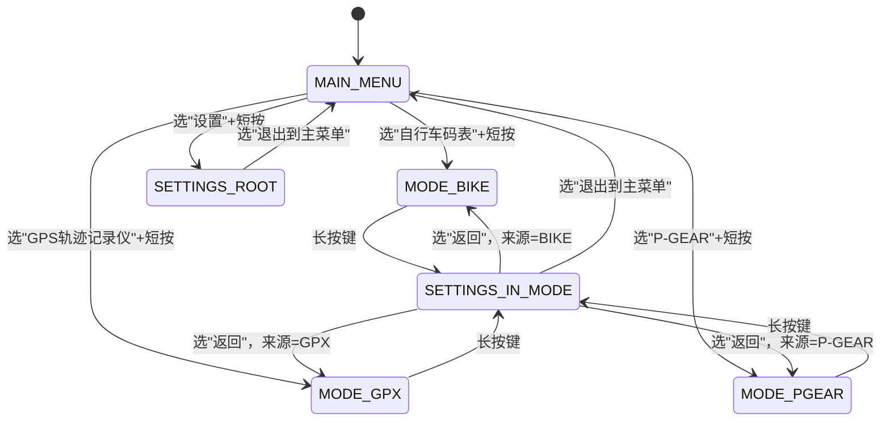
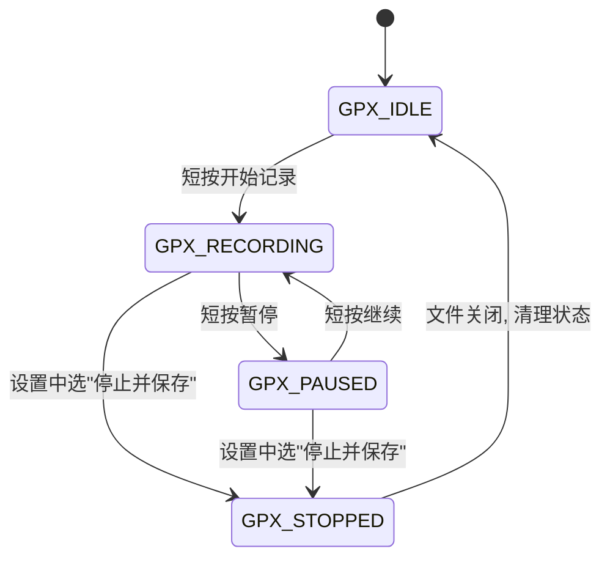
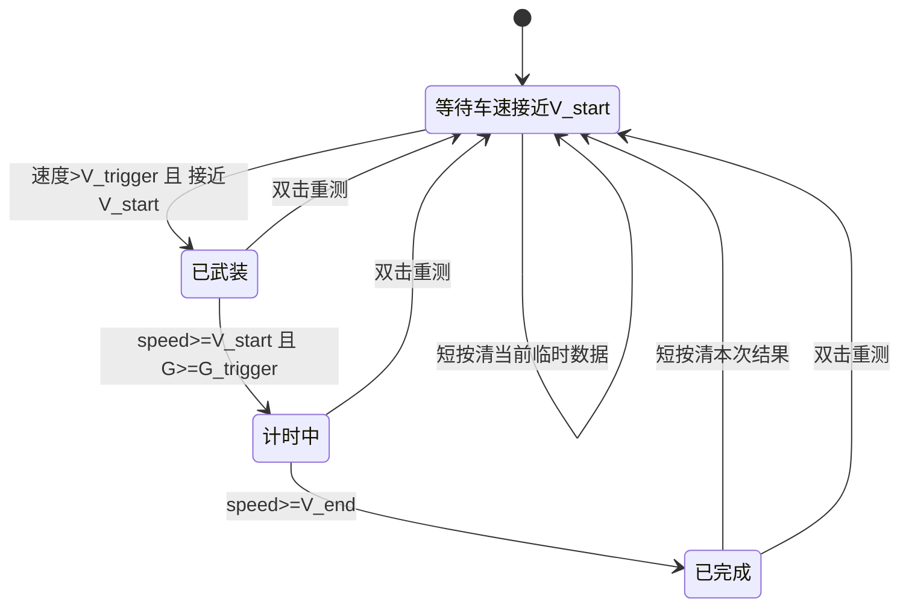
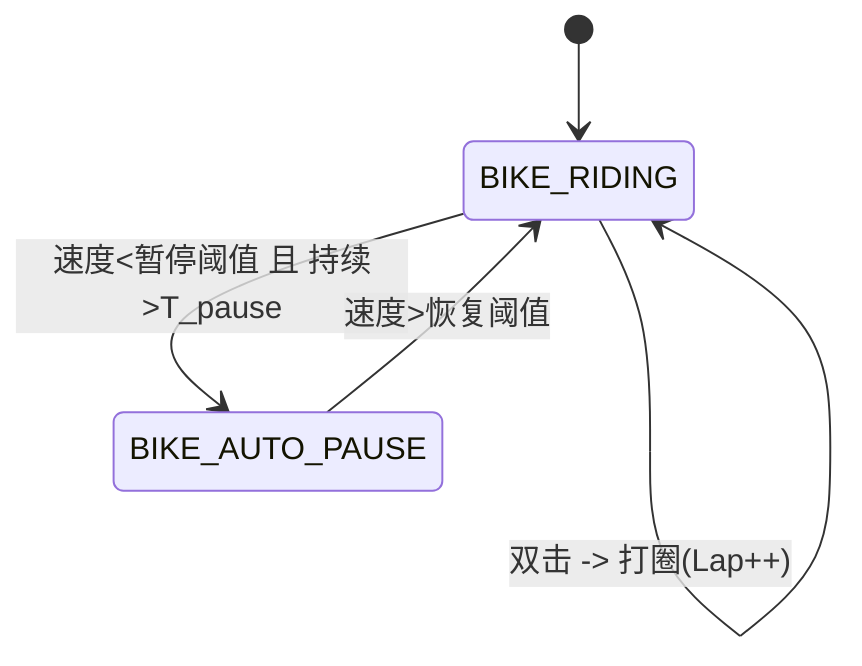
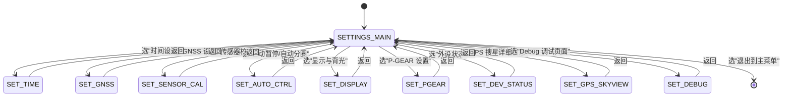

# ESP32S3 三合一设备

## 软件需求规格书（SRS）v1.4

---

## 0. 概述

* **设备功能集：**

  1. 自行车码表（Bike Computer）
  2. GPS 轨迹记录仪（GPX Recorder）
  3. P-GEAR 汽车 0–100 加速测试

* **硬件平台：**

  * SoC：ESP32-S3FH4R2（4MB Flash，2MB PSRAM）
  * GNSS：u-blox NEO-M8N（UART1）
  * IMU：LSM6DSR（I2C，6 轴）
  * 磁力计：LIS2MDL（I2C）
  * 气压计：BMP388（I2C）
  * 显示：ST7789 240×320 竖屏（旋转 180°）
  * 存储：SD 卡，4-bit SDIO（SDMMC + DMA）
  * 输入：旋转编码器 + 单按键
  * 电源相关：电池 ADC，充电状态引脚

* **软件环境：**

  * ESP-IDF v6.1（I2C 使用 **v6.0+ 新驱动 API**）
  * FreeRTOS
  * LVGL（UI 框架）
  * LovyanGFX（LCD 驱动）

* **风格与本地化要求：**

  * 代码语言：C 为主，可封装少量 C++
  * **注释必须使用中文**，源码统一 UTF-8 编码
  * 标识符统一英文，`lower_snake_case` 命名
  * UI 文本：本版本仅支持中文，不做多语言切换
  * 模块分层清晰，接口规范，便于 AI 生成和维护

* **当前版本限制：**

  * 不启用 WiFi 功能（避免 ADC2/BAT_ADC 与 WiFi 冲突）
  * 不实现 OTA / SD 卡升级，仅支持串口刷写固件

---

## 1. 硬件资源与外设

### 1.1 GPIO 分配（固定）

| 模块          | 信号                | GPIO  | 说明                       |
| ----------- | ----------------- | ----- | ------------------------ |
| 调试串口        | DEBUG_TX / RX     | 43/44 | UART0 @115200，调试/日志      |
| GNSS        | GNSS_TX / GNSS_RX | 17/18 | UART1，连接 NEO-M8N         |
| GNSS 电源     | GPS_LDO_EN        | 14    | 输出，高电平上电                 |
| I2C0        | SCL / SDA         | 39/40 | 400 kHz，总线挂 IMU/MAG/BARO |
| IMU LSM6DSR | I2C 地址            | —     | 0x6A                     |
| MAG LIS2MDL | I2C 地址            | —     | 0x1E                     |
| BARO BMP388 | I2C 地址            | —     | 0x76                     |
| LCD SPI3    | SCK / MOSI        | 5/8   | LovyanGFX 接口             |
|             | CS / DC           | 7/6   | 片选 / 数据/命令               |
|             | RST / BL          | 4/9   | 复位 / 背光 PWM 输出           |
| SDIO        | SD_CLK            | 36    | SDMMC 主机时钟，使用 DMA        |
|             | SD_CMD            | 35    | 命令线                      |
|             | SD_D0             | 37    | 数据线 0                    |
|             | SD_D1             | 38    | 数据线 1                    |
|             | SD_D2             | 34    | 数据线 2                    |
|             | SD_D3             | 33    | 数据线 3                    |
| 旋转编码器       | ENC_A / ENC_B     | 1/3   | 上拉输入，正交编码器               |
| 主按键         | KEY_MAIN          | 2     | 上拉输入                     |
| 电池检测        | BAT_ADC           | 12    | 1:1 分压输入，ADC2 通道         |
| 充电状态        | CHRG_STATUS       | 21    | 输入，引脚逻辑由硬件定义（后文约定）       |

> 说明：
>
> * 软件中禁用 WiFi，避免 ADC2 资源与 WiFi 抢占。
> * BAT_ADC 为 1:1 分压，硬件必须保证 ADC 输入电压不超过推荐上限，软件中需注明 ADC 衰减模式与量程关系。
> * GPIO3 为 strapping 管脚，硬件应保证上电默认电平满足启动要求，上电后可作为普通输入使用。
> * 硬件无 SD 卡插拔检测，本项目视为**不支持热插拔**：记录过程中用户拔卡为异常行为。

### 1.2 显示屏

* 控制器：ST7789
* 分辨率：240×320
* 方向：竖屏（物理），软件设置旋转 180°
* 接口：SPI3，配合 LovyanGFX；背光 PWM（GPIO9，2 kHz，默认 50% 占空比）
* 建议：

  * 使用 RGB565（16bit）色深
  * 刷新使用 SPI DMA（GDMA）

### 1.3 I2C 使用要求（ESP-IDF v6 新接口）

* 必须使用 ESP-IDF v6.0+ 的新 I2C 主机接口 `driver/i2c_master.h`，**禁止**使用旧版 `driver/i2c.h`。
* 初始化流程：

  * 使用 `i2c_new_master_bus()` 创建 `i2c_master_bus_handle_t bus`。
  * 对 IMU/MAG/BARO 调用 `i2c_master_bus_add_device()` 创建 `i2c_master_dev_handle_t`。
* 访存接口：

  * 写寄存器：`i2c_master_transmit()`
  * 读寄存器：`i2c_master_receive()`
  * 写后读：`i2c_master_transmit_receive()`
  * 探测设备：`i2c_master_probe()`
* 新旧 API 不得混用；I2C 相关源文件仅允许包含 `i2c_master.h` / `i2c_types.h`，不允许包含 `i2c.h`。

---

## 2. 输入设备与交互逻辑

### 2.1 主按键（KEY_MAIN）事件定义

按键支持 5 种事件类型：

| 事件名        | 条件（按下时长）        | 主要用途                     |
| ---------- | --------------- | ------------------------ |
| 短按（CLICK）  | `< 300 ms`      | 菜单选择 / 一般确认 / 子菜单        |
| 双击（DOUBLE） | 400 ms 窗口内两次短按  | BIKE：打圈；GPX：打点；P-GEAR：重测 |
| 中按（MID）    | 700–1300 ms     | 预留扩展功能                   |
| 长按（LONG）   | ≥ 1.5 s 且 < 8 s | 功能模式内进入设置                |
| 超长按（ULTRA） | ≥ 8 s           | 预留，不在本版本中定义具体动作          |

**消抖与优先级：**

* 实现 ≥ 100 ms 按键消抖。
* 双击识别窗口：从第一次短按释放开始计 400 ms；

  * 在窗口结束前不要立即发 CLICK，需等确认是否发生第二次短按；
* 长按 / 超长按优先级：

  * 当按下时间超过 LONG 阈值时：不再识别 CLICK/DOUBLE，仅产生 LONG 或 ULTRA；
  * 时间窗口重叠时，优先级：`ULTRA > LONG > DOUBLE > MID > CLICK`。

**日志要求：**

* 每次按键事件触发时，必须立刻通过 UART0 输出事件日志（格式见第 11 章）。

### 2.2 旋转编码器

* ENC_A/ENC_B 使用 GPIO 中断，正交编码。
* **4 倍细分**：

  * 以 A/B 两路所有有效边沿为“脉冲”，综合方向信息，每累计 4 个边沿视为 1 步；
* 方向判定：

  * 例如：A 相超前 B 为顺时针（ENC_RIGHT），反之为逆时针（ENC_LEFT），具体方向在代码注释中固定说明。
* 去抖和超时：

  * 建议在中断中仅增减原始脉冲计数，在一个周期任务中（1–5 ms）统计步数；
  * 若两步之间时间间隔 ≥ 1000 ms，则清零“未凑满一整步的残余脉冲数”，已经发出的步事件不受影响；
  * 这样既能过滤极慢干扰，又不会影响慢速、精确调节。

**事件日志：**

* 每次产生一个 ENC_LEFT / ENC_RIGHT 步事件时输出 `[EVT]` 日志。

### 2.3 各模式下输入行为

#### 2.3.1 主菜单（MAIN_MENU）

* 旋钮：

  * ENC_LEFT / ENC_RIGHT：在菜单项之间上下移动高亮光标。
* 主按键：

  * CLICK：进入当前高亮菜单项（Bike / GPX / P-GEAR / 设置）。
  * DOUBLE/MID/LONG/ULTRA：当前版本保留，不绑定行为。

> 进入“设置”仅允许通过“选中设置 + CLICK”，主菜单中 LONG 不进入设置，避免与模式页逻辑混淆。

#### 2.3.2 MODE_BIKE（自行车码表）

* 旋钮：

  * 在 BIKE 数据页之间切换（如主数据页 / 扩展数据页 / Lap 列表页）。
* 按键：

  * CLICK：打开/关闭 BIKE 子菜单（如：返回数据页 / 查看 Lap / 清除本次骑行 / 返回主菜单）。
  * DOUBLE：打圈（Lap++），不改变当前页面。
  * MID：预留功能（例如切换辅助视图等，可在后续版本使用）。
  * LONG：进入设置页面 `SETTINGS_IN_MODE`，记录来源=BIKE。
  * ULTRA：预留，不绑定行为。

#### 2.3.3 MODE_GPX（轨迹记录）

* 旋钮：

  * 切换 GPX 的不同信息页（如“状态页 / 文件列表页”等）。
* 按键：

  * CLICK：

    * 在 `GPX_IDLE`：开始记录，进入 `GPX_RECORDING`。
    * 在 `GPX_RECORDING`：暂停记录，进入 `GPX_PAUSED`。
    * 在 `GPX_PAUSED`：继续记录，回到 `GPX_RECORDING`。
  * DOUBLE：在当前轨迹文件上打一个 waypoint（打点），记录在 GPX 扩展或日志中。
  * MID：预留功能（如切换显示模式）。
  * LONG：进入设置页面 `SETTINGS_IN_MODE`（来源=GPX）。在设置中提供菜单项“停止记录并保存文件”，用户确认后从 RECORDING/PAUSED -> STOPPED -> IDLE。
  * ULTRA：预留，不绑定行为。

#### 2.3.4 MODE_P_GEAR（0–100 测速）

* 旋钮：

  * 在 P-GEAR 实时页面与历史记录页面之间切换。
* 按键：

  * CLICK：

    * 在 `PGEAR_IDLE`：清除当前测试的临时数据（本次用时等），不影响历史最佳成绩，保持 `PGEAR_IDLE`。
    * 在 `PGEAR_FINISHED`：清除本次测试结果，回到 `PGEAR_IDLE`，保留历史最佳成绩。
    * 在 `PGEAR_ARMED` / `PGEAR_RUNNING`：默认无动作。
  * DOUBLE：

    * 在任意 P-GEAR 状态（IDLE/ARMED/RUNNING/FINISHED）下，强制重置为 `PGEAR_IDLE`（重测），保留历史最佳成绩。
  * MID：预留。
  * LONG：进入设置页面 `SETTINGS_IN_MODE`（来源=P-GEAR）。
  * ULTRA：预留，不绑定行为。

---

## 3. 时间与 RTC 系统

1. 软件维护一个软件 RTC（实时时钟）。
2. 上电首次启动时，RTC 初始值为编译时间：`__DATE__` + `__TIME__`。
3. 设置页面中提供“时间设置”子页面：

   * 用户可设置年月日时分秒；
   * 更改时间后立即更新 RTC。
4. 时间源选项（在设置页中可选）：

   * 仅手动设置；
   * GNSS 自动同步（优先）。
5. 时间源行为：

   * 编译时间只作为上电初始值，不作为持续时间源；
   * 手动设置时间会立即修改 RTC，当时间源为“GNSS 自动同步”时，GNSS 可对其做小幅修正；
   * GNSS 时间同步规则：

     * 使用 RMC/GGA 中的时间和日期，要求状态有效（Status='A'）。
     * 若 GNSS 时间与当前 RTC 时间差值 |Δt| < 2 s，视为候选同步值。
     * 只有连续 N 次（建议 N=3）满足上述条件时，才执行同步，避免因单次异常跳变。
     * 首次成功同步时，在 UI 上显示“时间同步完成”提示 2 秒。
     * 若 GNSS 长时间无有效时间（如 NMEA_OK=0），则保持当前 RTC，不做强制回退。
6. GPX `<time>` 字段：

   * 所有 GPX `<time>` 必须统一使用 **UTC 时间**；
   * 格式：`YYYY-MM-DDThh:mm:ssZ`；
   * 由当前 RTC 时间通过时区转换得到（本项目可要求 RTC 内部直接维护 UTC，或维护本地时间并在写出前转换）。
7. `timestamp_ms`：

   * 所有结构体中 `timestamp_ms` 字段统一为**自上电以来的毫秒数**；
   * 来源推荐使用 `esp_timer_get_time() / 1000`；
   * 类型 `uint32_t`，约 49.7 天回绕，使用中要考虑回绕逻辑。

---

## 4. GNSS（NEO-M8N）

### 4.1 初始化 & 波特率配置

1. 拉高 `GPS_LDO_EN`（GPIO14），延时 ≥ 100 ms。
2. UART1 使用 9600 bps 接收 NMEA。
3. 通过 UBX `CFG-PRT` 配置 UART 端口波特率为 115200 bps。
4. 发送 `CFG-CFG` 保存配置（保存到 GNSS 内部 Flash）。
5. 重新将 UART1 配置为 115200 bps：

   * 等待约 2 秒，确认是否收到有效的 NMEA/UBX 数据。
6. 若 115200 bps 下无有效数据：

   * 回退到 9600 bps，再尝试发送配置（最多重试 3 次）；
   * 若仍失败：

     * 固定使用 9600 bps；
     * 在心跳与外设状态中标记“GNSS baud change failed，fallback 9600”。

### 4.2 星座 / 更新率 / NMEA 输出控制

* 星座模式（设置页可选）：

  * GPS
  * GPS + BeiDou
  * GPS + GLONASS
* 更新率（设置页可选）：

  * 1 Hz
  * 5 Hz
* 默认配置：

  * 星座：GPS + BeiDou；
  * 更新率：1 Hz。
* 配置策略：

  * 用户更改设置后：

    * 将配置写入 NVS（带版本号）；
    * 立即通过 UBX 指令配置 GNSS；
  * 上电时：

    * 从 NVS 读取配置；
    * 若无有效配置则使用默认值；
    * 无论 GNSS 内部记忆如何，ESP 端每次上电统一下发配置。

**高更新率时的 NMEA 限制：**

* 当更新率为 5 Hz（包括 P-GEAR 自动提升的情况）时：

  * 必须通过 `UBX-CFG-MSG` 调整 NMEA 报文输出：

    * 保留 RMC 和 GGA（5 Hz）；
    * GSA/GSV 等多卫星状态报文关闭或降为 1 Hz。
  * DOP、卫星 SNR 等信息可以通过 UBX 消息（如 NAV-DOP、NAV-SAT）获取。
* 本版本不启用 10 Hz 更新率；

  * 若将来需要 10 Hz，将配合更高波特率（如 460800 bps）或 UBX-only 数据通道在线路图中另行定义。

### 4.3 数据结构与状态判定

```c
typedef struct {
    uint32_t timestamp_ms;  // 自上电以来毫秒

    double   lat;      // 纬度，度
    double   lon;      // 经度，度
    float    alt;      // GNSS 高度，m
    float    speed;    // 水平速度，m/s
    float    course;   // 航向，度 0~360
    float    hdop;     // 水平精度因子
    float    vdop;     // 垂直精度因子
    float    pdop;     // 位置精度因子
    uint8_t  sats;     // 使用卫星数
    uint8_t  fix;      // 0: 无 / 2: 2D / 3: 3D
    bool     valid;    // 定位是否有效
} gnss_fix_t;
```

**`valid` 判定：**

* 当 `fix >= 2` 且 `hdop < 5.0` 时，认为 `valid = true`；
* 否则 `valid = false`。

**`NMEA_OK` 定义：**

* 最近 5 秒内至少接收到并成功解析 1 条**有效** GGA 或 RMC（Status='A'），则 `NMEA_OK = 1`；
* 否则 `NMEA_OK = 0`。

**其他说明：**

* 当 `valid=false` 时，可以继续提供最近一次有效定位的 `lat/lon/alt`，方便图形显示，但心跳日志中必须标明 `valid=0` 与 `NMEA_OK` 状态，避免误判。

### 4.4 GNSS 辅助气压计 P0 校准

* 触发条件：

  * `fix = 3D`；
  * `valid = true`；
  * `hdop < 2.0`；
  * 水平速度 `speed < 2 m/s`（减小运动时高度噪声）。
* 触发频率：

  * 每 5–10 秒进行一次校准。
* 算法：

  * 使用当前 GNSS 高度 `h_gnss` 与气压计实测气压 `P`，根据 ISA 标准大气模型反算海平面参考气压 `P0_meas`；
  * 使用一阶低通滤波更新 `P0`：
    [
    P0_{\text{new}} = \alpha \cdot P0_{\text{meas}} + (1-\alpha)\cdot P0_{\text{old}}
    ]

    * 建议 `alpha ≈ 0.1`；
  * 得到的 `P0` 用于后续高度计算，平滑地贴近 GNSS 高度。

---

## 5. 传感器系统（IMU / MAG / BARO）

### 5.1 坐标系约定

统一车体坐标系（右手系）：

* X：前进方向；
* Y：车体左侧方向；
* Z：垂直向上。

IMU/MAG 安装方向需通过轴变换统一到该坐标系。

### 5.2 IMU（LSM6DSR）

* I2C 地址：0x6A
* 工作配置：

  * ODR：104 Hz；
  * 加速度：±4 g；
  * 陀螺仪：±1000 dps。
* 轴变换（板上安装方向）：

```c
ax = -ax_raw;
ay =  ay_raw;
az = -az_raw;

gx = -gx_raw;
gy =  gy_raw;
gz = -gz_raw;
```

* 单位：

  * 加速度在结构体中使用 m/s²（需将原始值乘以量程比例）；
  * 角速度在结构体中使用 dps（度每秒），Mahony 算法内部可转换为 rad/s。
* 输出：

  * 原始含重力加速度：`ax, ay, az`；
  * 角速度：`gx, gy, gz`；
  * 温度：`imu_temp_c`（°C）。

### 5.3 磁力计（LIS2MDL）

* I2C 地址：0x1E；
* ODR ≥ 20 Hz；
* 校准结构体：

```c
typedef struct {
    float m_matrix[9];   // 3x3 软铁矩阵，按行存储
    float m_offset[3];   // 3x1 硬铁偏移
} mag_calib_t;
```

* 初始值：

  * `m_matrix` 为单位矩阵；
  * `m_offset` 为全 0。
* 校准流程（设置 → 传感器校准 → 磁力计校准）：

  * UI 提示用户在 30–60 秒内缓慢、多方向地旋转设备；
  * 采集足够多的磁场样本；
  * 在 MCU 端拟合软铁/硬铁参数，更新 `m_matrix` 与 `m_offset`；
  * 成功后提示“校准成功”，失败则“校准失败：数据不足/拟合失败”等。
* 存储：

  * 校准结果以二进制形式存储在 NVS 中（带版本号）。
  * 提供“恢复默认磁力计校准”菜单（重置为单位矩阵+0 偏移）。
* 温度字段：

  * 若芯片支持温度测量，填充 `mag_temp_c`；
  * 否则填 `NAN`。

### 5.4 气压计（BMP388）

* I2C 地址：0x76；
* 建议配置：

  * 模式：Normal；
  * Pressure OSR×4，Temp OSR×1；
  * IIR 滤波系数 ≥ 3；
  * ODR ≥ 25 Hz。
* 输出：

  * `pressure`：Pa；
  * `baro_temp_c`：°C；
  * `altitude`：m，使用 ISA 标准大气模型计算：
    [
    h = \frac{T_0}{L}\left[\left(\frac{P_0}{P}\right)^{\frac{R L}{g}} - 1\right]
    ]

    * T0 = 288.15 K，L=0.0065 K/m；
    * R = 287.05 J/(kg·K)，g=9.80665 m/s²；
    * `P0` 来自 4.4 的 GNSS 辅助校准。
* 显示时：

  * 心跳/外设状态页面中以 kPa 显示气压，`p_kpa = pressure / 1000.0f`。

### 5.5 统一传感器数据结构

```c
typedef struct {
    uint32_t timestamp_ms;         // 自上电以来毫秒

    // IMU
    float ax, ay, az;              // 含重力加速度，m/s²
    float ax_lin, ay_lin, az_lin;  // 线性加速度（Mahony 输出），m/s²
    float gx, gy, gz;              // 角速度，dps
    float gx_grav, gy_grav, gz_grav; // 重力向量估计，m/s²
    float imu_temp_c;              // IMU 温度，°C

    // MAG
    float mx, my, mz;              // 磁场（经过矩阵+偏移校准后）
    float mag_temp_c;              // °C（不支持时用 NAN）

    // BARO
    float pressure;                // Pa
    float altitude;                // 高度，m
    float baro_temp_c;             // 气压计温度，°C
} sensor_sample_t;
```

> 本版本要求 `ax_lin/ay_lin/az_lin` 和 `gx_grav/gy_grav/gz_grav` 必须由 Mahony 姿态解算计算得到，不允许为空或简单置零。

### 5.6 采样节奏与下采样

* IMU（加速度 + 陀螺仪）原始采样：104 Hz；
* MAG 原始采样：20–50 Hz；
* Mahony AHRS 更新：50 Hz（由传感器任务驱动），每次更新使用最近一次 IMU+MAG 数据；
* BARO：ODR≥25 Hz，可下采样到 10–20 Hz 用于高度和垂直速度估计；
* UI 刷新与数据更新：10–20 Hz；
* 心跳：每 5 s。

### 5.7 Mahony 姿态解算（**必须实现**）

**输入：**

* 加速度：`ax, ay, az`（m/s²，已转换到车体坐标系）；
* 角速度：`gx, gy, gz`（dps，内部转换为 rad/s）；
* 磁场：`mx, my, mz`（已做软铁/硬铁校准，单位任意，在算法内归一化）。

**更新频率：**

* Mahony 算法更新频率约 50 Hz；
* 使用精确的 `dt`（单位 s），`dt` 要求误差 < 5%。

**算法行为：**

* 维护四元数 `q` 作为姿态状态量（地球系→车体系）。
* 使用 Mahony 互补滤波：

  * 利用陀螺积分给出短期预测；
  * 利用加速度与磁力计测得的重力/地磁方向纠正漂移；
  * 核心参数：比例增益 `Kp`，积分增益 `Ki`（可根据实际调整，Ki 不稳定可置 0）。
* 加速度异常处理：

  * 当加速度模长偏离重力显著（如 |a| > 1.2g）可降低加速度在姿态更新中的权重，避免起步/颠簸时姿态乱跳。
* 磁场异常处理：

  * 当磁场模长与标定值差异过大（如 ±30%）时，可降低磁场权重或暂时跳过磁修正，避免磁干扰导致航向突变。

**输出：**

1. 四元数 `q`；
2. 欧拉角（roll/pitch/yaw，度）；
3. 重力向量在车体坐标系下分量 `g_body = (gx_grav, gy_grav, gz_grav)`；
4. 线性加速度（去重力）：
   `ax_lin = ax - gx_grav` 等。

**与 `sensor_sample_t` 的映射：**

* `gx_grav/gy_grav/gz_grav`：Mahony 计算的重力向量分量（单位 m/s²）；
* `ax_lin/ay_lin/az_lin`：IMU 实测加速度减去重力分量；
* 欧拉角：

  * 不直接存入 `sensor_sample_t`，但需通过 API 提供给上层（例如 `sensor_get_euler()`），用于 UI 坡度显示、P-GEAR 分析等。

**对上层功能的支持：**

* BIKE：

  * 坡度（%）可基于姿态 + 高度变化进行更稳定计算；
  * 垂直速度可利用高度变化 + 线性加速度估计。
* P-GEAR：

  * 起步检测使用“前向线性加速度”结合 GNSS（详见第 8 章）；
  * 车辆侧倾/上下坡对加速度的影响可通过姿态解算修正。

---

## 6. 轨迹记录（GPX Recorder，MODE_GPX）

### 6.1 文件系统与挂载

* 使用 FATFS 文件系统；
* 通过 SDMMC 主机（4-bit SDIO + DMA）挂载；
* 上电后尝试挂载 SD 卡：

  * 若挂载失败：

    * 禁用 GPX 功能；
    * 在外设状态页显示 `SD: mounted=0 err=xxx`；
    * 在日志中记录错误。
* 成功挂载后检查 `/GPX/` 目录：

  * 不存在则尝试创建；
  * 创建失败时：

    * 禁用 GPX 功能；
    * 提示“GPX 目录错误”。

### 6.2 文件命名与 GPX 结构

* 文件路径：`/GPX/YYYYMMDD_HHMMSS.gpx`；
* 文件名时间戳来自 RTC 当前时间（UTC/本地由实现统一设计）；
* GPX 版本：1.1；
* 结构：

  * `<gpx>` 根元素；
  * `<trk>`：一条轨迹；
  * `<trkseg>`：若干段；
  * `<trkpt>`：每个记录点；

每个 `<trkpt>` 示例：

```xml
<trkpt lat="39.123456" lon="116.123456">
  <ele>123.4</ele>
  <time>2024-03-15T10:30:00Z</time>
  <extensions>
    <speed>7.5</speed>           <!-- m/s -->
    <course>123.4</course>       <!-- deg -->
    <pressure>101325</pressure>  <!-- Pa -->
    <temperature>25.6</temperature> <!-- °C (baro_temp_c) -->
  </extensions>
</trkpt>
```

> 当前版本不扩展加速度/磁场/电池等额外字段，仅使用上述速度、航向、气压、温度。

### 6.3 写点策略

在 `GPX_RECORDING` 状态下，满足以下条件之一即认为“需要写一个点”（写入**内存缓冲**）：

1. 距离上一个点时间间隔 ≥ 1 s；
2. 与上一个点水平距离差 ≥ 5 m。

**静止过滤：**

* 若当前速度 < 0.5 m/s 且与上一个点的水平距离 < 2 m，则可以忽略本次写点（认为静止）。

**频率限制：**

* 即使距离条件频繁满足，也需保证连续两点之间时间间隔 ≥ 0.5 s，避免异常高频写点。

**文件膨胀控制：**

* 允许设定每小时最大写点数量（例如 7200 点，平均 0.5 s/点）；超过后：

  * 优先执行时间条件（≥1 s）；
  * 忽略仅由 5 m 距离条件触发的多余写点。

> 注意：“写点”此处指写入 RAM 缓冲，不等于立刻写入 SD 卡。

### 6.4 暂停、分段与停止

* 暂停：

  * 手动暂停（CLICK）或 Auto Pause 时：

    * 结束当前 `<trkseg>`（写入闭合标签）；
    * 状态进入 `GPX_PAUSED`。
* 恢复：

  * 再次 CLICK：

    * 新建 `<trkseg>` 开始记录；
    * 状态返回 `GPX_RECORDING`。
* 停止记录：

  * 在设置菜单 `SETTINGS_IN_MODE` 中选择“停止记录并保存文件”：

    * 若当前为 `GPX_RECORDING` 或 `GPX_PAUSED`：

      * 写入所有未写 `<trkpt>` 到 RAM 缓冲；
      * 将缓冲 flush 到 SD；
      * 正确闭合 `<trkseg>`、`<trk>`、`<gpx>` 标签；
      * 调用 `f_sync`、关闭文件；
      * 状态切换到 `GPX_STOPPED`，然后清理状态返回 `GPX_IDLE`。

### 6.5 写入错误与 SD 故障处理

* 若 `f_write` 或 `f_sync` 返回错误：

  * LOG_TASK 记录错误；
  * 尝试重新挂载 SD 卡，最多重试 3 次；
  * 若仍失败：

    * 停止当前记录，切换到 `GPX_STOPPED` / `GPX_IDLE`；
    * UI 显示“SD 错误，记录已停止”；
    * 后续不再尝试写入当前文件。
* 由于无热插拔检测：

  * 用户在记录过程中拔出 SD 卡，被视为上述写入错误场景的一种。

### 6.6 写缓冲与块写策略（双缓冲）

为降低 SD 卡写入延迟和写放大：

1. **双缓冲：**

   * 在 PSRAM 中分配两个缓存块 `buf_a`、`buf_b`，每个 4KB 或 8KB；
   * LOG_TASK 将 GPX 点和日志文本写入“当前活动缓冲”（如 `buf_a`）；
   * 当当前缓冲写满时：

     * 切换到另一缓冲 `buf_b` 接收新数据；
     * 将已满缓冲一次性通过 `f_write` 写入 SD 卡。
2. **块对齐：**

   * 尽量保证每次写入大小接近 4KB 对齐，以减少 Flash 写放大。
3. **Flush 时机：**

   * 缓冲写满；
   * 用户暂停/停止 GPX 记录；
   * 低电量准备关机；
   * 定时安全 flush：例如 3–5 s 内没有写满缓冲也应将现有数据写出并 `f_sync`，防止断电丢失太多。
4. **LOG_TASK 行为：**

   * 仅负责从 `gpx_queue` / `log_queue` 取数据写入 RAM 缓冲；
   * 实际对 SD 的 `f_write` / `f_sync` 由写缓冲模块统一控制；
   * 避免高频小写导致长时间 `f_sync` 卡顿。

---

## 7. 自行车码表（Bike Computer，MODE_BIKE）

### 7.1 实时数据内容与定义

至少显示以下数据（可分多页）：

* 当前速度（km/h）
* 平均速度（移动时间平均，不包含 Auto Pause 期间）
* 最大速度（当前骑行中出现的最大有效速度）
* 当次骑行时间 / 总时间：

  * 当次骑行时间：从本次开始记录起的有效骑行时间（排除 Auto Pause）
  * 总时间：包括暂停时间的总计
* 当前里程 / 累计里程：

  * 当前里程：本次骑行距离
  * 累计里程：可选持久化，所有骑行累计（可在设置中查看/清零）
* 当前高度（m）
* 坡度（%）：

  * 可结合气压高度与姿态解算的俯仰角估算；
* 累计爬升 / 累计下降（m）
* 航向（°）：

  * GNSS 航向 + MAG/AHRS 综合；
* 垂直速度（m/h 或 m/s）：

  * 建议使用最近 10–30 s 高度变化的滑动平均。

**异常值处理：**

* 对速度、航向、海拔等 GNSS 数据需要简单异常值滤波（例如速度突然 >100km/h 的孤立点可丢弃）。

### 7.2 Lap（圈）

* 双击主按键触发打圈：

  * Lap 序号自 1 开始递增；
  * 对每个 Lap 记录：

    * Lap 距离（从上一圈或起点算起）；
    * Lap 时间（移动时间）；
    * Lap 平均速度（Lap 距离 / Lap 移动时间）。
* Lap 上限：

  * 单次骑行最多 999 个 Lap，超过后新 Lap 触发将被忽略，并在日志中提示溢出；
* Lap 查看：

  * 在 BIKE 子菜单中提供“Lap 列表”页面；
  * 按 Lap 序号显示关键数据；
  * 可通过旋钮翻页浏览。
* Lap 数据在本次骑行结束 / 设备重启后默认清空，不强制持久化。

### 7.3 自动暂停（Auto Pause）

* 条件：

  * 当速度 < `V_pause_threshold` 且持续时间 > `T_pause_delay`：

    * 进入 Auto Pause 状态（不计入移动时间、不增加里程/GPX 写点）；
  * 当速度 > `V_resume_threshold` 时恢复正常骑行；
* 默认参数（示例）：

  * `V_pause_threshold = 3 km/h`
  * `V_resume_threshold = 5 km/h`
  * `T_pause_delay = 5 s`
* 可配置范围：

  * 速度阈值：1–10 km/h，步长 1 km/h；
  * 时间延迟：1–30 s，步长 1 s。
* Auto Pause 参数在 BIKE 和 GPX 模式共用，以保证“移动时间”的定义一致。

### 7.4 自动分圈（Auto Lap）

* 根据累计距离自动打圈：

  * 用户可在“自动暂停/自动分圈”页面设置 Auto Lap 距离；
  * 默认关闭；
  * 可选范围：1–50 km，步长 1 km。
* Auto Lap 与手动打圈同时存在：

  * Auto Lap 打圈的 Lap 序号与手动 Lap 共用一条序号链。

### 7.5 持久化与溢出

* 持久化建议：

  * 可在 NVS 中持久化累计里程、累计骑行时间；
  * 若数值超过一定范围（如 > 99999 km），可提示用户“是否清除统计”，或自动回绕。
* 单次骑行数据（本次里程、Lap 列表等）默认随设备重启清空。

---

## 8. P-GEAR（0–100 加速测试，MODE_P_GEAR）

### 8.1 功能定位

* 模拟汽车 0–100 km/h 加速测试；
* 支持自定义起始/结束速度范围（如 0–50、20–100 等）；
* 提供本次成绩、最佳成绩与历史记录列表。

### 8.2 设置项与单位

* 起始速度 `V_start`（km/h）；
* 结束速度 `V_end`（km/h，必须 > V_start）；
* 触发加速度阈值 `G_trigger`：

  * 内部以 m/s² 存储和计算；
  * UI 中以 g 显示，换算 `1 g ≈ 9.80665 m/s²`；
* 触发速度阈值 `V_trigger`（km/h）：

  * 防止低速噪声，只有当车速首次超过 `V_trigger` 时，才允许 P-GEAR 状态机进入 ARMED。

### 8.3 状态机逻辑

状态：`PGEAR_IDLE`、`PGEAR_ARMED`、`PGEAR_RUNNING`、`PGEAR_FINISHED`。

* `PGEAR_IDLE`：

  * 显示当前参数，等待车速接近 `V_start`；
  * “接近 `V_start`”定义：`|speed - V_start| <= 2 km/h`；
  * 当速度第一次超过 `V_trigger` 后，才认为可以武装。
* `PGEAR_ARMED`：

  * 当前速度接近或略低于 `V_start`，系统已经“准备好”；
  * 当 `speed >= V_start` 且加速度 / AHRS 条件满足时转入 RUNNING。
* `PGEAR_RUNNING`：

  * 计时中；
  * 根据起点（由 IMU 辅助或 GNSS）和当前 GNSS 速度，实时更新用时。
* `PGEAR_FINISHED`：

  * 当 `speed >= V_end` 时停止计时，记录本次测试；
  * UI 显示本次用时、本次最高速度等。

### 8.4 GNSS 刷新率自动提升

* 当进入 `MODE_P_GEAR` 时：

  * 记录当前 GNSS 更新率设置（1 Hz 或 5 Hz）；
  * 若当前更新率 < 5 Hz：

    * 通过 UBX 将更新率临时提高到 5 Hz；
    * 并按 4.2 要求精简 NMEA（仅 5 Hz 的 RMC/GGA，GSV 等关闭或降频）。
* 当退出 `MODE_P_GEAR` 时：

  * 恢复用户原先配置的更新率和 NMEA 输出。

> 本版本不启用 10 Hz 更新率。如后续需要 10 Hz，将结合更高波特率和 UBX-only 路径另行定义。

### 8.5 IMU + Mahony 辅助起步检测

为提高计时起点精度：

1. 使用 Mahony 结果获取车体姿态：

   * 从姿态解算中得到前向方向向量 `forward`（在车体坐标系中通常接近 +X）。
2. 在 IDLE/ARMED 状态：

   * 将线性加速度投影到前向方向，得到 `a_forward`；
   * 对 `a_forward` 进行高通或阈值判断：

     * 当 `a_forward > A_start_threshold`（例如 0.2–0.3 g）时，认为触发起步；
     * 记录起步时刻 `t_start_imu`（使用 `timestamp_ms`）。
3. 在随后 GNSS 样本中：

   * 当 GNSS 速度首次达到 `V_start` 或略高于 `V_start` 时：

     * 若最近一次 `t_start_imu` 与当前时间差 < 1 s，则以 `t_start_imu` 为计时起点；
     * 否则以 GNSS 达到 `V_start` 的时刻为起点。
4. 若 AHRS 故障或线性加速度异常：

   * 可关闭 IMU 辅助起步，退回纯 GNSS + G_trigger 的逻辑。

### 8.6 历史记录、最佳成绩与清空

* 每次完成测试（进入 `PGEAR_FINISHED`）记录：

  * 时间戳（RTC）；
  * `V_start` / `V_end`；
  * 用时；
* 历史记录：

  * 保存最近 N 条记录（建议 N=20）；
  * 按时间排序（最新在前）；
  * 存入 NVS（带版本号）。
* 最佳成绩：

  * 自动维护一个“best time”（在所有历史中选择最小用时的记录）。
* 清空：

  * 设置页面提供：

    * “清除 P-GEAR 历史记录”（删除所有历史记录）；
    * “清除 P-GEAR 最佳成绩”（仅清空 best，历史记录保留）。

---

## 9. UI 设计与视觉规范

### 9.1 视觉风格与字体

* 字体：

  * 使用 LVGL 默认字体或自定义等宽/易读字体；
  * 数字类大号字体（速度/时间）：高度约 32–48 px；
  * 普通文本：高度 14–18 px。
* 颜色：

  * 浅色背景 + 深色文字为默认主题；
  * 关键数字可使用高亮色（如绿色/橙色），但整体风格简洁；
* 主题：

  * “显示与背光”页面中预留主题选项：浅色 / 深色；
  * 若暂不实现深色主题，可将选项设为灰置。
* 背光：

  * PWM 频率固定 2 kHz；
  * 亮度 10–100%，步长 10%，可在设置中调整；
  * 默认 50%。

### 9.2 主菜单（第一屏）

```text
+--------------------------------+
|           ESP32S3 BOX          |
|          (logo / 标题)         |
|--------------------------------|
|  > 自行车码表 (Bike)           |
|    GPS 轨迹记录仪 (GPX)        |
|    P-GEAR 加速测试             |
|    设置 (Settings)             |
|--------------------------------|
|  旋钮：上下选择                 |
|  短按：进入                     |
+--------------------------------+
```

* LVGL 建议：

  * 根容器：`lv_obj`；
  * 标题：`lv_label`；
  * 菜单：`lv_list` 或竖直排布 `lv_btn` + `lv_label`；
  * 高亮项用 `LV_STATE_FOCUSED` 或自定义样式。

### 9.3 BIKE 主数据页（Page 1）

```text
+--------------------------------+
| 速度(km/h)                     |
| [    28.5    ]                 |
|--------------------------------|
| 距离(km)       骑行时间        |
| [  12.34 ]    [ 00:35:21 ]     |
|--------------------------------|
| 海拔(m)        坡度(%)         |
| [   135  ]    [   6.5   ]      |
|--------------------------------|
| ENC：切换页  短按：菜单        |
| 双击：打圈   长按：设置        |
+--------------------------------+
```

* 每个数据块使用 `lv_obj` + 两个 `lv_label`（标题+数值）。

### 9.4 BIKE 扩展数据页（Page 2）

```text
+--------------------------------+
| 平均速(km/h)   最大速(km/h)    |
| [  23.1  ]     [   46.3 ]      |
|--------------------------------|
| 爬升(m)         下降(m)        |
| [  520   ]     [   430  ]      |
|--------------------------------|
| 航向(°)        垂直速度(m/h)   |
| [  123  ]      [   520  ]      |
|--------------------------------|
| ENC：切页    短按：菜单        |
| 双击：打圈   长按：设          |
+--------------------------------+
```

### 9.5 GPX 轨迹记录页面

```text
+--------------------------------+
| GPS 轨迹记录仪                 |
| 状态: [记录中/暂停/空闲]       |
| 文件数:[ 12 ]                  |
|--------------------------------|
| 当前文件:                      |
| [ 20240315_103000.gpx      ]   |
|--------------------------------|
| 距离(km):   [ 12.35 ]          |
| 速度(km/h): [ 25.4  ]          |
| 高度(m):    [  128  ]          |
| 卫星数:     [  10   ] Fix:3D   |
|--------------------------------|
| 短按：开始/暂停 双击：打点      |
| 长按：设置（可停止并保存）      |
+--------------------------------+
```

### 9.6 P-GEAR 页面

```text
+--------------------------------+
|       P-GEAR 0-100 测试        |
| 状态: [等待中/武装/计时中/完]  |
|--------------------------------|
| 当前速度(km/h): [  32.4 ]      |
| 当前加速度(G):  [  0.68 ]      |
|--------------------------------|
| 目标: [ 0  -> 100 km/h ]       |
| 本次用时: [  6.32 s ]          |
| 最佳成绩: [  5.98 s ]          |
|--------------------------------|
| ENC：实时/历史  短按：清本次    |
| 双击：重测      长按：设置      |
+--------------------------------+
```

* 在“历史”视图中，将 `本次用时/最佳成绩` 区块替换为历史列表。

### 9.7 设置主界面

```text
+--------------------------------+
|            设置                |
|--------------------------------|
| > 时间设置（RTC）              |
|   GNSS 设置                    |
|   传感器校准                   |
|   自动暂停/自动分圈            |
|   显示与背光                   |
|   P-GEAR 设置                  |
|   外设状态                     |
|   GPS 搜星详细信息             |
|   Debug 调试页面               |
|   返回（回原功能）             |
|   退出到主菜单                 |
+--------------------------------+
```

* “返回（回原功能）”：回到进入设置前所在的模式（Bike/GPX/P-GEAR）；
* “退出到主菜单”：直接回到 MAIN_MENU，不回原模式页面。

### 9.8 设置 → 显示与背光

* 可调参数：

  * 背光亮度：10–100%，步长 10%；
  * 自动熄屏时间：关闭 / 15 s / 30 s / 60 s；
  * 主题：浅色 / 深色（可选实现）。
* 调整亮度时实时生效。

### 9.9 设置 → 外设状态

```text
+--------------------------------+
|          外设状态              |
|--------------------------------|
| GNSS: fix=3D valid=1           |
|       sats=10 NMEA_OK=1        |
|       lat=.. lon=.. alt=..     |
|--------------------------------|
| IMU: ax=.. ay=.. az=..         |
|      lin=.. gx=.. gy=.. gz=..  |
|      temp=..°C                 |
|--------------------------------|
| MAG: mx=.. my=.. mz=..         |
|      temp=..°C                 |
|--------------------------------|
| BARO: p=101.5kPa alt=..m       |
|       temp=..°C                |
|--------------------------------|
| SD: mounted=1 err=0            |
| BATT: 3.92V chg=0              |
|--------------------------------|
| 短按：返回  长按：退出到主菜单 |
+--------------------------------+
```

* 数据来源：

  * 使用最近一次缓存的传感器/GNSS/电源数据；
  * 进入该页面后，每 1 s 刷新一次显示。

### 9.10 设置 → GPS 搜星详细信息

```text
+--------------------------------+
|         GPS 搜星状态           |
|--------------------------------|
| Fix: 3D  HDOP:0.9  PDOP:1.5    |
| 卫星: 使用10 / 可见14          |
|--------------------------------|
| PRN | SNR | Use | SYS | El |Az |
|  03 | 35  |  *  | G   |45 |120 |
|  08 | 42  |  *  | G   |60 |200 |
|  11 | 18  |     | B   |20 | 80 |
| ...                            |
|--------------------------------|
| (底部可绘制 SNR 柱状图)        |
| 短按：返回                     |
+--------------------------------+
```

* Use：`*` 表示参与定位；
* SYS：`G`=GPS，`B`=BeiDou，`R`=GLONASS 等；
* 更新频率：1 Hz，从 UBX NAV-SAT 或类似报文读取。

### 9.11 Debug 调试页面

建议内容：

* 固件版本号（如 v1.4.x）、编译时间；
* 当前可用 Heap/PSRAM 及使用率；
* 关键任务栈余量；
* 日志丢弃计数、心跳丢失计数等；
* 最近一次看门狗触发（如果有）的信息。

---

## 10. 状态机定义（Mermaid）

### 10.1 顶层模式状态机



### 10.2 GPX 记录状态机



### 10.3 P-GEAR 状态机



### 10.4 BIKE Auto Pause / Lap 状态机



### 10.5 设置菜单导航



---

## 11. 日志与心跳（UART0）

### 11.1 日志系统总则

* 所有日志通过 `log_queue` 发送到 LOG_TASK；
* LOG_TASK 将日志写入 UART 发送缓冲和/或 SD 写缓冲；
* 为避免阻塞：

  * UART 发送采用非阻塞或短超时；
  * 队列或缓冲满时允许丢弃日志，并记录“日志丢弃计数”；
* 日志格式：

  * 文本行，人类可读；
  * 不使用 JSON/二进制/CRC。

### 11.2 心跳日志（每 5 秒）

* HEARTBEAT_TASK 每 5 s 触发一次，允许 ±1 s 抖动；
* 系统繁忙或串口不可用时，可允许跳过 1–2 次心跳，但需记录“心跳丢失计数”。

**内容：**

* 时间 `t`（`timestamp_ms`）；
* 当前模式 `mode`；
* GNSS：

  * `fix/valid/sats/hdop/vdop/pdop/lat/lon/alt/NMEA_OK`；
* IMU：

  * `ax/ay/az/ax_lin/ay_lin/az_lin/gx/gy/gz/imu_temp_c`；
* MAG：

  * `mx/my/mz/mag_temp_c`；
* BARO：

  * `pressure`（kPa）、`altitude`、`baro_temp_c`；
* SD：

  * `mounted / last_err`；
* 电池：

  * 电压（V）、充电状态（chg=0/1）。

**示例：**

```text
[HB] t=123456ms mode=MODE_BIKE
     gnss: fix=3D valid=1 sats=10 hdop=0.9 vdop=1.2 pdop=1.5
           lat=39.9845 lon=116.3185 alt=201.3m NMEA_OK=1
     imu: ax=-0.02 ay=0.01 az=9.80 lin_ax=0.10 lin_ay=0.02 lin_az=0.05 temp=32.5
     mag: mx=12.3 my=-5.6 mz=30.1 temp=28.0
     baro: p=101.5kPa alt=123.4m temp=25.6C
     sd: mounted=1 err=0
     batt: volt=3.92V chg=0
```

### 11.3 输入事件日志

* 每次按键/旋钮事件：

```text
[EVT] t=234567ms mode=MODE_BIKE type=BTN_DOUBLE_CLICK
[EVT] t=234890ms mode=MODE_BIKE type=ENC_RIGHT
```

* 若队列满导致日志丢弃，应在 Debug 页面中展示丢弃计数。

---

## 12. FreeRTOS 任务、通信与资源管理

### 12.1 任务列表与核心分配

| 任务名            | 功能                       | 优先级 | 建议栈大小        | 建议绑核           |
| -------------- | ------------------------ | --- | ------------ | -------------- |
| UI_TASK        | LVGL 刷新与渲染               | 6   | 6144–8192 字节 | APP CPU（core1） |
| HEARTBEAT_TASK | 心跳与系统状态汇总                | 4   | 2048–3072 字节 | APP CPU（core1） |
| GNSS_TASK      | GNSS UART 收发解析           | 7   | 4096–6144 字节 | PRO CPU（core0） |
| SENSOR_TASK    | IMU/MAG/BARO 采样 + Mahony | 6   | 4096–6144 字节 | PRO CPU（core0） |
| LOG_TASK       | SD/GPX 批量写入与日志管理         | 5   | 4096–6144 字节 | PRO CPU（core0） |
| SYS_TASK       | 顶层模式机与子状态机               | 6   | 4096–6144 字节 | PRO CPU（core0） |
| POWER_TASK     | 电池电量测量与电源策略              | 4   | 2048 字节      | PRO CPU（core0） |
| INPUT_TASK     | 按键/旋钮采样与事件识别             | 4   | 2048–3072 字节 | PRO CPU（core0） |

> 设计意图：
>
> * core1 专注 UI（UI_TASK + HEARTBEAT 轻量任务），保证界面流畅；
> * core0 承担 GNSS、传感器、日志、状态机、电源、输入等后台任务；
> * 将 INPUT_TASK 放在 core0，有利于未来统一规划轻量运行/深度睡眠唤醒策略（如只保持 core0 运行）。

### 12.2 通信机制与队列

* 队列：

  * `gnss_event_queue`：GNSS_TASK → SYS_TASK/UI_TASK；
  * `sensor_event_queue`：SENSOR_TASK → SYS_TASK/UI_TASK；
  * `input_event_queue`：INPUT_TASK → SYS_TASK；
  * `log_queue`：各任务 → LOG_TASK；
* 队列深度：

  * 一般建议 16–32；
* 队列发送策略：

  * 任务上下文发送可设短超时（如 10–50 ms），避免长时间阻塞；
  * ISR 中发送使用无阻塞 API，发送失败则丢弃并在 Debug 里统计；
* 互斥量：

  * `fs_mutex`：保护 FATFS/文件系统操作；
  * `config_mutex`：保护 NVS 配置读写；
* 事件优先级原则：

  * 输入事件 > 状态机更新 > UI 刷新 > 心跳 > 日志；
  * 所有输入事件建议先进入 SYS_TASK，由 SYS_TASK 根据当前模式分发，避免各模块直接抢占处理。

### 12.3 看门狗（WDT）

* 启用系统 Watchdog 和 Task Watchdog；
* 对关键任务（SYS_TASK、UI_TASK、SENSOR_TASK 等）设置常规超时（如 1–2 s）；
* 对 LOG_TASK：

  * 由于涉及 SD 写入，`f_write/f_sync` 偶尔可能阻塞数百 ms，Task WDT 超时需适当放宽（如≥5 s）；
  * LOG_TASK 不应在 SD 写入期间持有其他关键互斥锁，防止级联阻塞；
* Debug 页面中显示最近一次 WDT 触发信息（如有）。

### 12.4 电源管理与 BAT_ADC

* POWER_TASK 以 1–5 Hz 采样 BAT_ADC：

  * 使用移动平均滤波（例如 8 点窗口）；
* 阈值建议（可配置）：

  * 低电量提示：`Vbat < 3.4 V`；
  * 低电模式：`Vbat < 3.3 V` 时可自动降低背光亮度、关闭高功耗功能；
  * 安全关机：`Vbat < 3.2 V` 时执行：

    * 停止 GPX 记录并 flush 缓冲；
    * 保存必要配置；
    * 显示关机提示后重启或进入深度睡眠（具体行为可在实现中决定）。
* CHRG_STATUS：

  * 硬件确定 0/1 表示“充电中/未充电”的语义；
  * 软件中在注释里固定说明，并在“外设状态”页显示 `chg=0/1` 及相应文字（如“充电中/未充电”）。

### 12.5 配置存储与 NVS 分区

* 配置统一保存在 NVS 中：

  * 包括 GNSS 模式、Auto Pause/Lap 参数、显示设置、P-GEAR 设置、MAG 校准数据等；
* 配置结构统一带版本号，例如：

```c
typedef struct {
    uint16_t version;    // 配置版本号
    // 后续字段...
} app_config_t;
```

* 当读取到的版本号与当前固件不匹配：

  * 使用默认配置；
  * 覆盖 NVS 中旧配置。
* 分区建议：

  * 在 `partitions.csv` 中为 NVS 预留至少 16 KB；
  * 若未来需要频繁持久化大数据（如里程/历史记录），可增加独立 NVS 分区。

### 12.6 启动流程与自检

* 启动流程建议：

  1. 上电 → 显示 Logo/启动画面（1–2 s，可选）。
  2. 初始化基础外设：UART0、GPIO、I2C 总线、SDMMC、背光。
  3. 初始化 NVS，读取配置；如失败，尝试擦除指定分区后重建。
  4. 初始化 GNSS/IMU/MAG/BARO/SD 卡：

     * 某模块失败时：

       * 标记该模块为“不可用”；
       * 记录日志；
       * 不影响其他模块启动。
  5. 初始化 UI & LVGL & LovyanGFX，创建主菜单。
* 自检失败降级策略：

  * 例如 SD 初始化失败但其他模块正常：

    * 禁用 GPX 记录；
    * 保留 BIKE、P-GEAR 等功能；

### 12.7 资源共享与模式切换

* GNSS/IMU/MAG/BARO 采样任务常驻运行，不因模式切换而停；
* SD/GPX 写入仅在 GPX_RECORDING 状态下活跃，其他模式只读 SD（如浏览 GPX 列表）；
* UI 切换页面时：

  * 尽量重用缓存数据，不强制刷新所有内容；
  * 动画效果可以简单（淡入/淡出或直接切换），不做强制要求；
* 模式切换时共享资源注意：

  * 确保文件操作在 LOG_TASK 中序列化；
  * 避免在多个任务中直接打开/关闭同一文件对象。

---

## 13. 编码规范与代码风格

1. 源码统一 UTF-8，禁止使用 GBK 等其它编码。
2. 注释必须使用中文，要求简明说明函数用途、参数、返回值和注意事项。
3. 标识符统一英文：

   * 函数、变量：`lower_snake_case`；
   * 宏常量：`UPPER_SNAKE_CASE`；
   * 类型：`xxx_t`。
4. 所有公共函数必须在唯一的 `.h` 中声明；
5. 所有模块内部函数必须使用 `static` 限定；
6. 禁止两个 `.c` 文件中定义同名非 static 函数；
7. 缩进统一 4 个空格，不使用 Tab；
8. 控制结构统一格式，例如：

```c
if (cond) {
    // ...
} else {
    // ...
}
```

9. 函数应尽量短小，避免过深嵌套；除任务主循环外尽量避免长时间阻塞；
10. 建议提供 `.clang-format` 配置（参考 Espressif 示例工程风格）。

---

## 14. 安全与故障模式

* 超长按（ULTRA, ≥8 s）：

  * 作为预留事件，本版本不绑定具体动作；
  * 后续版本可扩展为“恢复出厂设置+重启”等，需要在 SRS 中明确擦除范围（哪些 NVS 键）。
* 模块异常：

  * 初始化失败最多重试 3 次；
  * 仍失败则标记“不可用”，不反复尝试导致阻塞。
* 看门狗：

  * 系统与任务 WDT 启用；
  * LOG_TASK WDT 超时设置较长；
  * Watchdog 相关信息在 Debug 页面展示。
* 故障降级：

  * SD 故障：禁用 GPX 记录，但保留其它功能；
  * GNSS 故障：BIKE 仍可使用 IMU/气压高度显示部分数据，但速度/导航类功能受限；
  * 传感器故障：相关页面明确显示“数据无效”。

---
