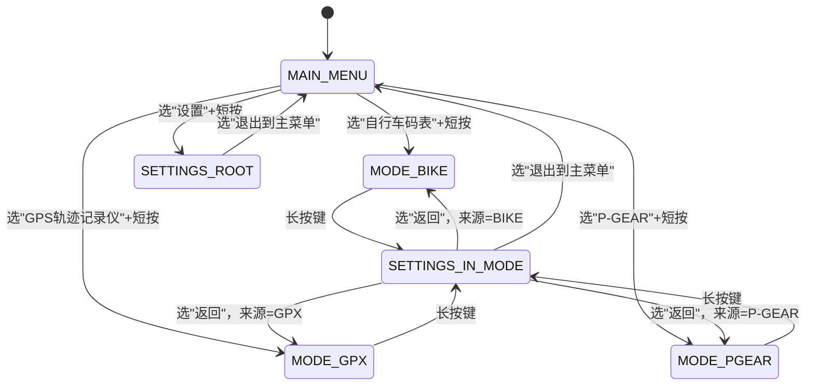
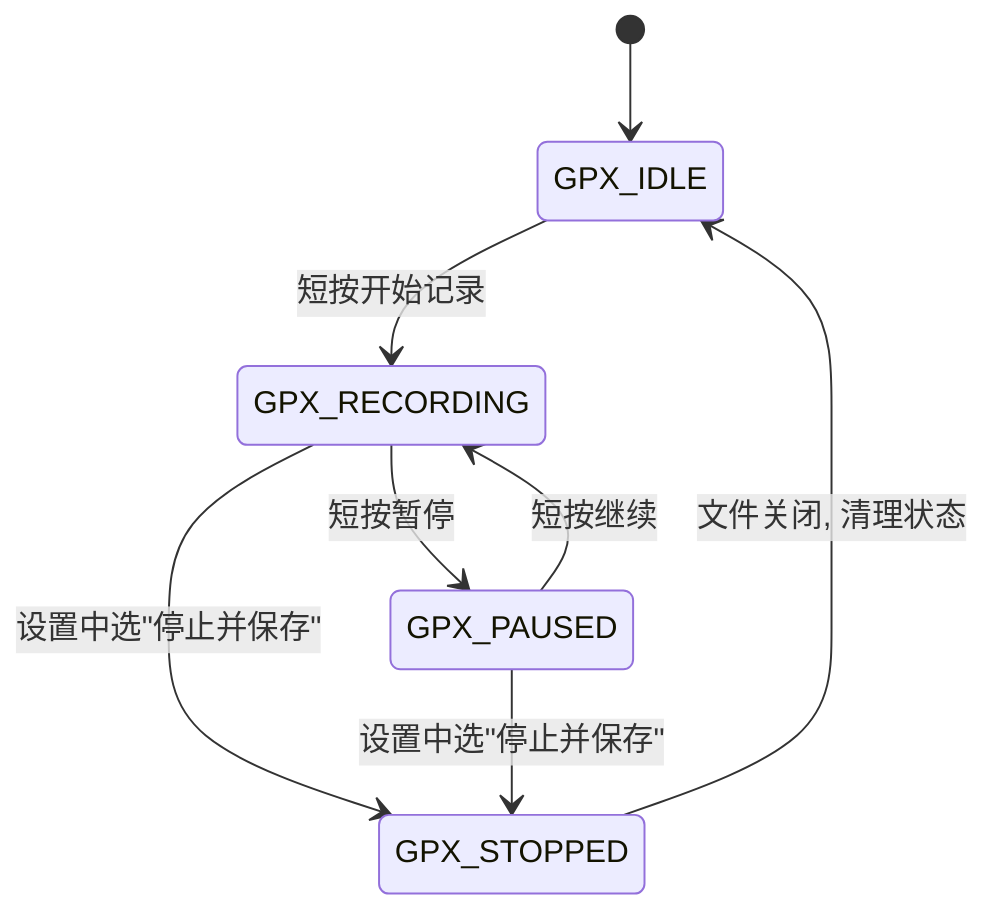
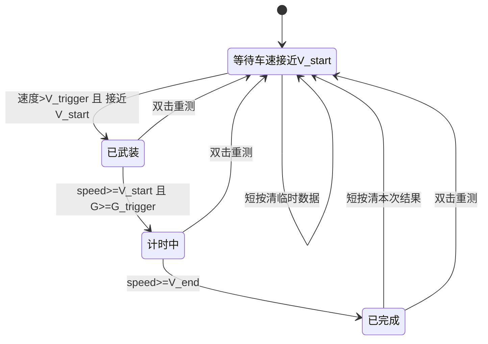
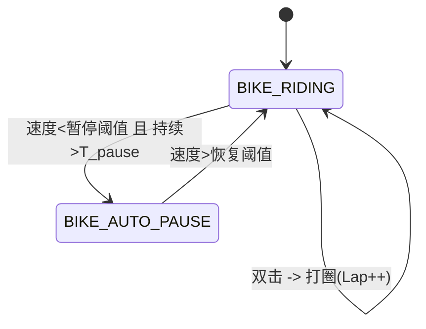
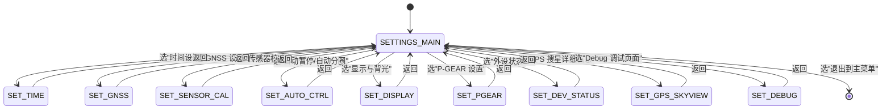

# ESP32S3 三合一设备

## 软件需求规格书（SRS）v1.5

---

## 0. 概述

### 0.1 功能概述

设备提供三大核心功能：

1. **自行车码表（Bike Computer）**
2. **GPS 轨迹记录仪（GPX Recorder）**
3. **P-GEAR 汽车 0–100 加速测试**

### 0.2 硬件平台

* SoC：ESP32-S3FH4R2

  * 4 MB Flash
  * 2 MB PSRAM
* GNSS：u-blox NEO-M8N（UART1）
* IMU：LSM6DSR（I2C，6 轴）
* 磁力计：LIS2MDL（I2C）
* 气压计：BMP388（I2C）
* 显示：ST7789 240×320 竖屏，软件旋转 180°
* 存储：SD 卡，4-bit SDIO（SDMMC + DMA）
* 输入：旋转编码器 + 单按键
* 电源：电池电压 ADC，充电状态引脚

### 0.3 软件环境

* ESP-IDF v6.1

  * **I2C 必须使用 v6 新驱动 `driver/i2c_master.h`**
* FreeRTOS
* LVGL（UI 框架）
* LovyanGFX（LCD 驱动）

### 0.4 架构与模块

* FreeRTOS 多任务 + 双核调度（core0/core1 区分）
* 数据中心模块：**DataModel / context_manager（`app_data_model_t` 单例）**
* 错误处理宏模块：`app_check.h` / `macro_def.h`（统一 CHECK_ERR 系列宏）
* 功能模块：

  * GNSS 模块
  * 传感器 + Mahony 姿态解算模块
  * GPX 记录模块
  * BIKE 码表逻辑模块
  * P-GEAR 状态机模块
  * UI 模块（各页面）
  * 输入模块（按键 + 旋钮）
  * 日志/心跳/存储模块
  * 电源管理模块

### 0.5 风格与本地化要求

* 代码语言：C 为主，可封装少量 C++
* **所有注释必须使用中文**
* 源码编码统一 UTF-8
* 标识符统一英文，`lower_snake_case` 命名
* UI 文本：本版本仅支持中文，不做多语言切换
* 模块分层清晰，接口规范，便于 AI 生成和维护

### 0.6 当前版本限制

* 不启用 WiFi 功能（避免 ADC2/BAT_ADC 与 WiFi 冲突）
* 不实现 OTA / SD 卡升级，仅支持串口刷写固件

---

## 1. 硬件资源与外设

### 1.1 GPIO 分配（固定）

| 模块          | 信号                | GPIO  | 说明                       |
| ----------- | ----------------- | ----- | ------------------------ |
| 调试串口        | DEBUG_TX / RX     | 43/44 | UART0 @115200，调试/日志      |
| GNSS        | GNSS_TX / GNSS_RX | 17/18 | UART1，连接 NEO-M8N         |
| GNSS 电源     | GPS_LDO_EN        | 14    | 输出，高电平上电                 |
| I2C0        | SCL / SDA         | 39/40 | 400 kHz，总线挂 IMU/MAG/BARO |
| IMU LSM6DSR | I2C 地址            | —     | 0x6A                     |
| MAG LIS2MDL | I2C 地址            | —     | 0x1E                     |
| BARO BMP388 | I2C 地址            | —     | 0x76                     |
| LCD SPI3    | SCK / MOSI        | 5/8   | LovyanGFX 接口             |
|             | CS / DC           | 7/6   | 片选 / 数据/命令               |
|             | RST / BL          | 4/9   | 复位 / 背光 PWM 输出           |
| SDIO        | SD_CLK            | 36    | SDMMC 主机时钟，使用 DMA        |
|             | SD_CMD            | 35    | 命令线                      |
|             | SD_D0             | 37    | 数据线 0                    |
|             | SD_D1             | 38    | 数据线 1                    |
|             | SD_D2             | 34    | 数据线 2                    |
|             | SD_D3             | 33    | 数据线 3                    |
| 旋转编码器       | ENC_A / ENC_B     | 1/3   | 上拉输入，正交编码器               |
| 主按键         | KEY_MAIN          | 2     | 上拉输入                     |
| 电池检测        | BAT_ADC           | 12    | 1:1 分压输入，ADC2 通道         |
| 充电状态        | CHRG_STATUS       | 21    | 输入，引脚逻辑由硬件定义（软件中说明语义）    |

> 说明：
>
> * 禁用 WiFi，避免 ADC2 与 WiFi 抢占。
> * BAT_ADC 为 1:1 分压，硬件保证电压不过上限，软件需注明 ADC 衰减模式。
> * GPIO3 为 strapping 管脚，上电电平满足启动要求，上电后可做普通输入。
> * 无 SD 卡插拔检测，本项目视为 **不支持热插拔**，记录过程中拔卡视为错误行为。

### 1.2 显示屏

* 控制器：ST7789
* 分辨率：240×320
* 方向：物理竖屏，软件设置旋转 180°
* 接口：SPI3 + LovyanGFX
* 背光：GPIO9，PWM 频率 2 kHz，默认占空比 50%
* 色深：RGB565（16 bits）
* 要求使用 SPI DMA（GDMA）进行刷屏

### 1.3 I2C 使用要求（ESP-IDF v6 新接口）

* 必须使用 ESP-IDF v6.0+ 的新 I2C 主机接口 `driver/i2c_master.h`。
* **严禁**使用旧版 `driver/i2c.h`，禁止出现以下旧 API：

  * `i2c_cmd_link_create` / `i2c_cmd_link_delete`
  * `i2c_master_start` / `i2c_master_stop`
  * `i2c_master_write_byte` / `i2c_master_write` / `i2c_master_read`
  * `i2c_master_read_byte` / `i2c_master_cmd_begin` 等
* 初始化流程示例：

  * 使用 `i2c_new_master_bus()` 创建 `i2c_master_bus_handle_t`；
  * 使用 `i2c_master_bus_add_device()` 为 IMU/MAG/BARO 创建 `i2c_master_dev_handle_t`。
* 访问接口：

  * 写：`i2c_master_transmit()`
  * 读：`i2c_master_receive()`
  * 写后读：`i2c_master_transmit_receive()`
  * 探测设备：`i2c_master_probe()`
* 新旧 API 禁止混用；I2C 模块只允许包含 `i2c_master.h` / `i2c_types.h`。

---

## 2. 输入设备与交互逻辑

### 2.1 主按键（KEY_MAIN）事件定义

按键支持 5 种事件类型：

| 事件名        | 条件（按下时长）        | 主要用途                     |
| ---------- | --------------- | ------------------------ |
| 短按（CLICK）  | `< 300 ms`      | 菜单选择 / 一般确认 / 子菜单        |
| 双击（DOUBLE） | 400 ms 窗口内两次短按  | BIKE：打圈；GPX：打点；P-GEAR：重测 |
| 中按（MID）    | 700–1300 ms     | 预留扩展功能                   |
| 长按（LONG）   | ≥ 1.5 s 且 < 8 s | 在模式页面中进入设置               |
| 超长按（ULTRA） | ≥ 8 s           | 预留系统级功能，本版本不绑定具体动作       |

**消抖与优先级：**

* 实现 ≥ 100 ms 按键消抖。
* 双击识别窗口：

  * 从第一次短按释放开始计时 400 ms；
  * 在窗口结束前，需等待确认是否出现第二次短按：

    * 如果出现第二次短按：触发 DOUBLE；
    * 若未出现，则认为是单次 CLICK。
* 长按 / 超长按对双击的抑制：

  * 当按下时间超过 LONG 阈值后，不再识别 CLICK/DOUBLE；
  * 优先级：`ULTRA > LONG > DOUBLE > MID > CLICK`。

**事件日志：**

* 每次按键事件产生时，必须立即输出一条 UART0 事件日志（格式见第 11 章）。

### 2.2 旋转编码器

* ENC_A / ENC_B 为正交编码器，接 GPIO 中断，内部上拉。
* **4 倍细分**：

  * 将 A/B 两路所有有效边沿综合，用于判断方向；
  * 每累计 4 个边沿记为 1 步，产生 ENC_LEFT 或 ENC_RIGHT 事件。
* 方向定义：

  * 例如：A 相领先 B 相为顺时针（ENC_RIGHT），反之为 ENCL_LEFT；
  * 具体方向在实现中通过注释固定说明。
* 去抖和超时：

  * 在中断中只累积脉冲计数；
  * 在一个 1–5 ms 周期的任务中统计步数；
  * 若两步之间时间间隔 ≥ 1000 ms，则清零“残余脉冲”，已发出的步事件不受影响；
  * 这样既过滤极慢干扰，又不影响慢速精调。

**事件日志：**

* 每产生一个步事件（ENC_LEFT/RIGHT）时，输出一行 [EVT] 日志。

### 2.3 主菜单（MAIN_MENU）交互

* 旋钮：

  * ENC_LEFT / ENC_RIGHT：菜单项上下移动光标。
* 主按键：

  * CLICK：进入当前高亮项目（Bike / GPX / P-GEAR / 设置）。
  * DOUBLE/MID/LONG/ULTRA：在主菜单中不绑定动作。

### 2.4 MODE_BIKE 模式交互

* 旋钮：

  * 在不同 BIKE 数据页（主数据页/扩展页/Lap 列表页）之间切换。
* 主按键：

  * CLICK：弹出/关闭 BIKE 子菜单（例如查看 Lap、清除本次骑行、返回主菜单）。
  * DOUBLE：打圈（Lap++），不改变当前页面。
  * MID：预留扩展功能（如切换副视图）。
  * LONG：进入设置页面 `SETTINGS_IN_MODE`（来源=BIKE）。
  * ULTRA：预留，不绑定行为。

### 2.5 MODE_GPX 模式交互

* 旋钮：

  * 在 GPX 状态页、文件列表页等不同子页之间切换。
* 主按键：

  * CLICK：

    * 在 `GPX_IDLE`：开始记录 → `GPX_RECORDING`；
    * 在 `GPX_RECORDING`：暂停记录 → `GPX_PAUSED`；
    * 在 `GPX_PAUSED`：恢复记录 → `GPX_RECORDING`。
  * DOUBLE：在当前轨迹上打点（waypoint），写入 GPX 或日志。
  * MID：预留扩展功能。
  * LONG：进入设置页面 `SETTINGS_IN_MODE`（来源=GPX），在设置中提供“停止记录并保存文件”的菜单项。
  * ULTRA：预留。

### 2.6 MODE_P_GEAR 模式交互

* 旋钮：

  * 在“实时页面”和“历史记录页面”之间切换。
* 主按键：

  * CLICK：

    * 在 `PGEAR_IDLE`：清空当前测试的临时数据（不影响历史最佳），仍保持 IDLE；
    * 在 `PGEAR_FINISHED`：清空本次结果，回到 IDLE；保留历史最佳；
    * 在 ARMED/RUNNING：默认不做处理。
  * DOUBLE：

    * 在任意 PGEAR 状态下，重置为 `PGEAR_IDLE`（重测），保留历史最佳。
  * MID：预留。
  * LONG：进入设置页面 `SETTINGS_IN_MODE`（来源=P-GEAR）。
  * ULTRA：预留。

---

## 3. 时间与 RTC 系统

1. 软件维护一个软件 RTC（实时时钟）。
2. 上电首次启动时，RTC 初始值为编译时间：`__DATE__` + `__TIME__`。
3. 设置页面中提供“时间设置”子页面：

   * 用户可设置年、月、日、时、分、秒；
   * 修改后立即更新 RTC。
4. 时间源选项：

   * “仅手动设置”；
   * “GNSS 自动同步”（优先）。
5. GNSS 自动同步逻辑：

   * 从 RMC/GGA 中获取时间和日期，要求状态有效（Status='A'）；
   * 若 GNSS 时间与当前 RTC 差值 |Δt| < 2 s，则视为可用候选；
   * 只有连续 N 次（建议 N=3）满足条件才实际更新 RTC，防止单次跳变；
   * 首次成功同步时，在 UI 上显示“时间同步完成”提示 2 秒；
   * 当 GNSS 长时间无有效时间（NMEA_OK=0）时，不强制回退，只保留 RTC 当前值。
6. GPX `<time>`：

   * 所有 GPX `<time>` 字段必须使用 **UTC 时间**；
   * 格式：`YYYY-MM-DDThh:mm:ssZ`；
   * RTC 可以直接维护 UTC；如维护本地时间，应在写出 GPX 前进行 UTC 转换。
7. `timestamp_ms` 约定：

   * 所有结构体中的 `timestamp_ms` 使用“自上电以来的毫秒数”；
   * 使用 `esp_timer_get_time()/1000` 获取；
   * 类型 `uint32_t`，需考虑约 49.7 天回绕。

---

## 4. GNSS（NEO-M8N）需求

### 4.1 初始化与波特率配置

1. 拉高 `GPS_LDO_EN`（GPIO14），延时 ≥ 100 ms。
2. UART1 初始配置为 9600 bps，接收 NMEA。
3. 使用 UBX `CFG-PRT` 配置波特率为 115200 bps。
4. 使用 `CFG-CFG` 保存配置到 GNSS 内部 Flash。
5. 重新将 UART1 配置为 115200 bps，等待约 2 s。
6. 判断是否在 115200 bps 收到有效 NMEA/UBX 数据：

   * 若成功：后续使用 115200 bps。
   * 若失败：

     * 回退到 9600 bps，重新尝试配置，最多重试 3 次；
     * 若仍失败：

       * 固定使用 9600 bps；
       * 在心跳与外设状态中标记“GNSS baud change failed，fallback 9600”。

### 4.2 星座模式 / 更新率 / NMEA 报文

* 星座模式（设置页面可选）：

  * GPS
  * GPS + BeiDou
  * GPS + GLONASS
* 更新率（设置页面可选）：

  * 1 Hz
  * 5 Hz
* 默认设置：

  * 星座：GPS + BeiDou；
  * 更新率：1 Hz。
* 配置策略：

  * 用户修改时：

    * 写入 NVS 存储；
    * 立即通过 UBX 配置 GNSS；
  * 上电时：

    * 从 NVS 读取配置；
    * 无有效配置则使用默认；
    * 每次上电都主动下发配置，防止 GNSS 内部状态不一致。

**NMEA 精简（高更新率时）：**

* 当更新率为 5 Hz 时：

  * 通过 `UBX-CFG-MSG` 配置：

    * 保留 RMC、GGA 为 5 Hz；
    * GSA/GSV 等报文关闭或降为 1 Hz；
* DOP、卫星 SNR 等可通过 UBX NAV-DOP / NAV-SAT 获得。

> 本版本不启用 10 Hz 更新率；如需启用，将结合更高波特率或 UBX-only 方案另行定义。

### 4.3 GNSS 数据结构

```c
typedef struct {
    uint32_t timestamp_ms;  // 自上电以来的毫秒计时

    double   lat;      // 纬度，度
    double   lon;      // 经度，度
    float    alt;      // GNSS 高度，m
    float    speed;    // 水平速度，m/s
    float    course;   // 航向角，度 0~360
    float    hdop;     // 水平精度因子
    float    vdop;     // 垂直精度因子
    float    pdop;     // 位置精度因子
    uint8_t  sats;     // 使用卫星数
    uint8_t  fix;      // 0: 无；2: 2D；3: 3D
    bool     valid;    // 定位是否有效
} gnss_fix_t;
```

### 4.4 `valid` 与 `NMEA_OK` 定义

* `valid` 判定：

  * 当 `fix >= 2` 且 `hdop < 5.0` 时，认为 `valid = true`；
  * 否则 `valid = false`。
* `NMEA_OK` 定义：

  * 最近 5 秒内至少接收到一条有效 GGA 或 RMC（Status='A'，解析成功），则 `NMEA_OK = 1`；
  * 否则为 0。
* 当 `valid = false` 时：

  * 可继续输出最近一次有效定位的 `lat/lon/alt` 用于显示；
  * 但心跳日志和外设状态中必须明确 `valid=0` 与 `NMEA_OK` 状态。

### 4.5 GNSS 辅助气压计校准 P0

* 触发条件：

  * `fix = 3D` 且 `valid = true`；
  * `hdop < 2.0`；
  * 水平速度 `speed < 2 m/s`。
* 触发频率：

  * 每 5–10 s 尝试校准一次。
* 计算流程：

  1. 取当前 GNSS 高度 `h_gnss` 和气压计气压 `P`；
  2. 根据标准大气模型反算海平面气压 `P0_meas`；
  3. 使用一阶低通：
     [
     P0_{\text{new}} = \alpha P0_{\text{meas}} + (1-\alpha) P0_{\text{old}}
     ]
     建议 `α ≈ 0.1`；
  4. 使用 `P0` 进行后续高度计算，平滑追踪 GNSS 高度。

---

## 5. 传感器系统（IMU / MAG / BARO + Mahony）

### 5.1 坐标系约定

统一车体坐标系（右手系）：

* X 轴：车辆前进方向；
* Y 轴：车辆左侧方向；
* Z 轴：垂直向上。

IMU / MAG 原始数据需通过轴变换统一到该坐标系。

### 5.2 IMU（LSM6DSR）

* I2C 地址：0x6A
* 推荐配置：

  * ODR：104 Hz；
  * 加速度量程：±4 g；
  * 陀螺仪量程：±1000 dps。
* 轴变换（根据实物安装方向）：

```c
ax = -ax_raw;
ay =  ay_raw;
az = -az_raw;

gx = -gx_raw;
gy =  gy_raw;
gz = -gz_raw;
```

* 单位要求：

  * 加速度：在结构体中以 m/s² 存储（需转换）；
  * 角速度：以 dps 存储，Mahony 内部需要时可转换为 rad/s。
* 输出内容：

  * `ax/ay/az`：含重力加速度；
  * `gx/gy/gz`：角速度；
  * `imu_temp_c`：IMU 温度（°C）。

### 5.3 磁力计（LIS2MDL）

* I2C 地址：0x1E
* ODR ≥ 20 Hz
* 软铁/硬铁校准结构：

```c
typedef struct {
    float m_matrix[9];   // 3x3 软铁矩阵
    float m_offset[3];   // 3x1 硬铁偏移
} mag_calib_t;
```

* 初始值：

  * `m_matrix` 为单位矩阵；
  * `m_offset` 为 0。
* 校准流程：

  * 设置页面中提供“磁力计校准”；
  * UI 提示用户在 30–60 秒内多方向旋转设备；
  * 收集样本，拟合软铁/硬铁参数；
  * 拟合成功后更新 `m_matrix` 与 `m_offset`，提示“校准成功”；
  * 拟合失败提示原因（数据不足/拟合失败）。
* 存储：

  * 结果存储于 NVS，带版本号；
  * 提供“恢复默认磁力计校准”（重置为单位矩阵+0 偏移）。
* 温度：

  * 若芯片支持，填入 `mag_temp_c`；
  * 否则填 `NAN`。

### 5.4 气压计（BMP388）

* I2C 地址：0x76
* 推荐配置：

  * 模式：Normal；
  * Pressure OSR×4；
  * Temp OSR×1；
  * IIR 滤波系数 ≥ 3；
  * ODR ≥ 25 Hz。
* 输出：

  * `pressure`：Pa；
  * `baro_temp_c`：°C；
  * `altitude`：m，根据标准大气公式计算：

[
h = \frac{T_0}{L}\left[\left(\frac{P_0}{P}\right)^{\frac{RL}{g}} - 1\right]
]

其中：

* T0 = 288.15 K，L = 0.0065 K/m
* R = 287.05 J/(kg·K)，g = 9.80665 m/s²
* `P0` 为 4.5 中 GNSS 辅助校准得到的海平面气压。

显示时：

* 外设状态页面以 kPa 显示：`p_kpa = pressure / 1000.0f`。

### 5.5 传感器统一数据结构

```c
typedef struct {
    uint32_t timestamp_ms;         // 自上电以来的毫秒计数

    // IMU
    float ax, ay, az;              // 含重力加速度，m/s²
    float ax_lin, ay_lin, az_lin;  // 线性加速度，m/s²（Mahony 输出）
    float gx, gy, gz;              // 角速度，dps
    float gx_grav, gy_grav, gz_grav; // 重力向量估计，m/s²
    float imu_temp_c;              // IMU 温度，°C

    // MAG
    float mx, my, mz;              // 磁场（经校准）
    float mag_temp_c;              // 磁力计温度，°C（不支持时为 NAN）

    // BARO
    float pressure;                // Pa
    float altitude;                // m
    float baro_temp_c;             // 气压计温度，°C
} sensor_sample_t;
```

### 5.6 采样节奏与下采样

* IMU（加计+陀螺）：104 Hz；
* MAG：20–50 Hz；
* Mahony 姿态解算：约 50 Hz；
* BARO：ODR ≥ 25 Hz，可下采样到 10–20 Hz 用于高度与垂直速度；
* UI 更新：10–20 Hz；
* 心跳：每 5 s。

### 5.7 Mahony 姿态解算（必须实现）

**输入：**

* `ax/ay/az`（m/s²，车体坐标系）；
* `gx/gy/gz`（dps，内部转 rad/s）；
* `mx/my/mz`（已做软铁/硬铁校正）。

**更新频率：**

* 约 50 Hz，使用精确 `dt`（s），误差 < 5%。

**算法要求：**

* 使用 Mahony 互补滤波：

  * 陀螺积分给出短期预测；
  * 利用加速度/磁力计方向做误差反馈，纠正漂移；
  * 使用可配置的比例增益 `Kp`、积分增益 `Ki`；
* 加速度振动时：

  * 当加速度模长偏离 1g 过大，如 `|a| > 1.2g`，降低加速度权重；
* 磁场异常时：

  * 当磁场模长与标定值差异 >30% 时，降低磁场权重或跳过磁修正。

**输出：**

1. 姿态四元数 `q`；
2. 欧拉角 roll/pitch/yaw（度）；
3. 重力向量在车体坐标系下：`gx_grav/gy_grav/gz_grav`；
4. 线性加速度：`ax_lin = ax - gx_grav` 等。

**与结构体映射：**

* `gx_grav/gy_grav/gz_grav`：Mahony 输出重力分量；
* `ax_lin/ay_lin/az_lin`：去重力之后的线性加速度。

**对上层功能支持：**

* BIKE：

  * 坡度（%）可基于 pitch + 高度变化计算；
  * 垂直速度可由高度变化和线性加速度综合估算。
* P-GEAR：

  * 利用前向线性加速度进行起步检测（见第 8 章）。

---

## 6. 轨迹记录（GPX Recorder，MODE_GPX）

### 6.1 文件系统与挂载

* 使用 FATFS，底层为 SDMMC 4-bit + DMA。
* 上电后：

  * 尝试挂载 SD 卡；
  * 若失败：

    * 禁用 GPX 记录功能；
    * 外设状态页显示 `SD: mounted=0 err=xxx`；
    * 日志记录错误。
* 挂载成功后检查 `/GPX/` 目录：

  * 若不存在，尝试创建；
  * 创建失败：

    * 禁用 GPX；
    * 提示“GPX 目录错误”。

### 6.2 文件命名与 GPX 结构

* 文件路径：`/GPX/YYYYMMDD_HHMMSS.gpx`，时间来自 RTC。
* 使用 GPX 1.1 标准：

  * `<gpx>` 根元素；
  * `<trk>` 包含一条轨迹；
  * `<trkseg>` 表示一个连续记录片段；
  * `<trkpt>` 为轨迹点。

**`<trkpt>` 示例：**

```xml
<trkpt lat="39.123456" lon="116.123456">
  <ele>123.4</ele>
  <time>2024-03-15T10:30:00Z</time>
  <extensions>
    <speed>7.5</speed>           <!-- m/s -->
    <course>123.4</course>       <!-- deg -->
    <pressure>101325</pressure>  <!-- Pa -->
    <temperature>25.6</temperature> <!-- °C (baro_temp_c) -->
  </extensions>
</trkpt>
```

> 当前版本扩展字段仅包括速度、航向、气压、温度。

### 6.3 写点策略

在 `GPX_RECORDING` 状态下，满足以下任一条件即认为需记录一个点（写入内存缓冲）：

1. 距离上一个点的时间间隔 ≥ 1 s；
2. 与上一个点的水平距离 ≥ 5 m。

**静止过滤：**

* 若当前速度 < 0.5 m/s 且与上一个点距离 < 2 m，则可跳过该点，认为静止。

**频率限制：**

* 保护性限制：两点间时间间隔最小为 0.5 s，避免异常高频写点。

**文件膨胀控制：**

* 可设置每小时最大点数（如 7200 点），超过后：

  * 优先保留时间间隔≥1 s 的点；
  * 距离触发的多余点可忽略。

### 6.4 暂停、分段与停止

* 暂停：

  * 手动暂停（按键）或 Auto Pause 时：

    * 写入当前 `<trkseg>` 的闭合标签；
    * 状态切换到 `GPX_PAUSED`。
* 恢复：

  * 再次按键开始：

    * 新建 `<trkseg>`；
    * 状态回到 `GPX_RECORDING`。
* 停止记录：

  * 在设置页面中选择“停止记录并保存文件”：

    * 若当前状态为 RECORDING 或 PAUSED：

      * 写入剩余缓冲的 `<trkpt>`；
      * 关闭 `<trkseg>`、`<trk>`、`<gpx>`；
      * `f_sync` 并关闭文件；
      * 状态 → `GPX_STOPPED` → 清理后回到 `GPX_IDLE`。

### 6.5 写入错误与 SD 故障处理

* 若 `f_write` 或 `f_sync` 返回错误：

  * LOG_TASK 记录错误；
  * 尝试重新挂载 SD 卡，最多 3 次；
  * 若仍失败：

    * 停止记录，关闭文件；
    * UI 显示“SD 错误，记录已停止”；
    * 当前文件可能不完整，但要尽力保证格式正确。
* 记录过程中用户拔卡：

  * 视为上述错误的一种。

### 6.6 双缓冲与批量写卡

为降低写放大与延迟：

1. 在 PSRAM 中分配两个缓冲：`buf_a` 和 `buf_b`，每个 4KB 或 8KB；
2. LOG_TASK 将 GPX 点/日志文本写入当前缓冲：

   * 缓冲满时：

     * 切换到另一缓冲；
     * 将旧缓冲一次性 `f_write`；
3. Flush 时机：

   * 缓冲写满；
   * 用户暂停/停止记录；
   * 低电量准备关机；
   * 周期性安全 flush（如每 3–5 s），防止断电丢失过多数据。

---

## 7. 自行车码表（Bike Computer，MODE_BIKE）

### 7.1 实时数据内容

至少包括：

* 当前速度：km/h；
* 平均速度：移动时间平均（Auto Pause 期间不计）；
* 最大速度：本次骑行中最大速度；
* 本次骑行时间 / 总时间：

  * 本次骑行时间：排除 Auto Pause 时间；
  * 总时间：包含暂停时间；
* 当前里程 / 累计里程：

  * 当前里程：本次骑行距离；
  * 累计里程：可选持久化（总骑行距离），可清零；
* 当前高度（m）；
* 坡度（%）：

  * 可结合姿态 pitch 和高度变化计算；
* 累计爬升 / 累计下降（m）；
* 航向（°）：

  * 综合 GNSS 航向与 MAG/AHRS 输出；
* 垂直速度（m/h 或 m/s）：

  * 建议基于高度变化的滑动平均。

**异常值处理：**

* 对速度、航向、高度进行简单异常滤波，例如：

  * 单个点速度 > 100 km/h 且孤立，可判为无效点。

### 7.2 Lap（圈）

* 用双击按键触发打圈：

  * Lap 序号从 1 递增；
  * 每个 Lap 记录：

    * Lap 距离；
    * Lap 移动时间；
    * Lap 平均速度。
* 上限：

  * 每次骑行最多 999 个 Lap，超过后新 Lap 忽略，并记录“Lap overflow”日志。
* Lap 查看：

  * BIKE 子菜单中提供“Lap 列表”页面；
  * 按 Lap 序号显示关键信息；
  * 旋钮翻页浏览。
* Lap 不强制持久化，随本次骑行结束或重启清空。

### 7.3 Auto Pause（自动暂停）

* 条件：

  * 当速度 < `V_pause_threshold` 且持续时间 > `T_pause_delay` 时：

    * 进入 “Auto Pause” 状态；
    * 暂停累计移动时间和里程；
  * 当速度 > `V_resume_threshold` 时：

    * 自动恢复骑行；
    * 重新计入移动时间和里程。
* 默认参数（可配置）：

  * `V_pause_threshold = 3 km/h`
  * `V_resume_threshold = 5 km/h`
  * `T_pause_delay = 5 s`
* 配置范围：

  * 速度阈值 1–10 km/h，步长 1 km/h；
  * 时间延迟 1–30 s，步长 1 s。
* 该参数在 BIKE 和 GPX 模式共用（保持“移动时间”定义一致）。

### 7.4 Auto Lap（自动分圈）

* 按距离自动打圈：

  * 设置中提供 Auto Lap 开关和距离；
  * 距离范围 1–50 km，步长 1 km；
  * 默认关闭。
* Auto Lap 与手动 Lap 共用同一 Lap 序号。

### 7.5 持久化与溢出

* 建议持久化：

  * 累计里程；
  * 累计骑行时间；
* 当累积数值太大（如 > 99999 km）时：

  * 可提示用户清零；
  * 或自动回绕，但需在 UI 明确显示格式。
* 本次骑行相关数据（包括 Lap）默认在电源循环后清空。

---

## 8. P-GEAR（0–100 加速测试，MODE_P_GEAR）

### 8.1 功能定位

* 用于测量车辆从 V_start 到 V_end 的加速时间；
* 支持 V_start/V_end 自定义（例如 0–50、20–100 km/h）。

### 8.2 设置项

* 起始速度 `V_start`（km/h）；
* 结束速度 `V_end`（km/h，必须 > V_start）；
* 触发加速度阈值 `G_trigger`：

  * 以 m/s² 存储，UI 以 g 显示；
  * 换算：1 g ≈ 9.80665 m/s²；
* 触发速度阈值 `V_trigger`（km/h）：

  * 只有当车速超过 `V_trigger` 后，才允许状态机进入 ARMED；
  * 用于过滤低速噪声。

### 8.3 P-GEAR 状态机

状态：`PGEAR_IDLE`、`PGEAR_ARMED`、`PGEAR_RUNNING`、`PGEAR_FINISHED`。

* `PGEAR_IDLE`：

  * 等待车辆速度接近 `V_start`；
  * “接近”定义为 `|speed - V_start| <= 2 km/h`。
* `PGEAR_ARMED`：

  * 已经接近 V_start，且速度 > V_trigger；
  * 当 `speed >= V_start` 且 `a_forward >= G_trigger` 时开始计时（进入 RUNNING）。
* `PGEAR_RUNNING`：

  * 计时进行中，使用 IMU 起步时间 + GNSS 速度确定；
  * 当 GNSS 速度达 `V_end` 时结束计时。
* `PGEAR_FINISHED`：

  * 记录本次测试结果（起止速度、用时、最大速度等）；
  * 等待用户操作（清除/重测）。

### 8.4 GNSS 刷新率自动提升

* 进入 `MODE_P_GEAR` 时：

  * 保存当前用户设置更新率；
  * 若当前更新率 < 5 Hz：

    * 通过 UBX 将更新率临时设为 5 Hz；
    * 同时精简 NMEA（仅 5 Hz 的 RMC/GGA，其他如 GSV 降成 1 Hz 或关闭）。
* 退出 `MODE_P_GEAR` 时：

  * 恢复用户原始设置。

### 8.5 IMU + Mahony 辅助起步检测

1. 从 Mahony 中得到车体姿态和前向方向向量。
2. 计算前向线性加速度 `a_forward`：

   * 将 `ax_lin/ay_lin/az_lin` 投影到车体前向（X 轴）方向。
3. 当车辆仍在 IDLE/ARMED 状态时：

   * 若 `a_forward > A_start_threshold`（例如 0.2–0.3 g），记录起步时间 `t_start_imu`；
4. 当 GNSS 速度首次达到 `V_start` 调整带时：

   * 若当前时间与 `t_start_imu` 差值 < 1 s，则以 `t_start_imu` 作为计时起点；
   * 否则使用 GNSS 达到 `V_start` 时刻作为起点。
5. 若 AHRS 故障或线性加速度数据异常：

   * 可退化为仅依赖 GNSS + 加速度阈值的逻辑。

### 8.6 历史记录与最佳成绩

* 每次完成一次测试：

  * 记录时间戳（RTC）、V_start/V_end、本次用时等；
* 历史记录：

  * 保存最近 N 条（如 20 条），按时间排序（最新在前）；
  * 持久化在 NVS 中，带版本号；
* 最佳成绩：

  * 从历史中选取用时最短的一条作为“最佳成绩”；
* 清空：

  * 设置页面中提供：

    * “清除 P-GEAR 历史记录”；
    * “清除 P-GEAR 最佳成绩”。

---

## 9. UI 设计与视觉规范

### 9.1 视觉风格

* 背景：默认浅色；
* 文本：深色，关键信息可用高亮颜色（如绿色/橙色）；
* 字体：

  * 数字大号（32–48 px）用于速度、时间等；
  * 普通文本 14–18 px；
* 主题：

  * 设置中预留“浅色/深色”主题选项；
  * 如短期不实现深色，可暂时固定浅色。

### 9.2 主菜单页面

```text
+--------------------------------+
|           ESP32S3 BOX          |
|          (logo / 标题)         |
|--------------------------------|
|  > 自行车码表 (Bike)           |
|    GPS 轨迹记录仪 (GPX)        |
|    P-GEAR 加速测试             |
|    设置 (Settings)             |
|--------------------------------|
|  旋钮：上下选择                 |
|  短按：进入                     |
+--------------------------------+
```

* LVGL：

  * 根容器：`lv_obj`；
  * 标题：`lv_label`；
  * 菜单：`lv_list` 或竖排 `lv_btn` + `lv_label`；
  * 高亮项使用 `LV_STATE_FOCUSED` 样式。

### 9.3 BIKE 主数据页（Page 1）

```text
+--------------------------------+
| 速度(km/h)                     |
| [    28.5    ]                 |
|--------------------------------|
| 距离(km)       骑行时间        |
| [  12.34 ]    [ 00:35:21 ]     |
|--------------------------------|
| 海拔(m)        坡度(%)         |
| [   135  ]    [   6.5   ]      |
|--------------------------------|
| ENC：切换页  短按：菜单        |
| 双击：打圈   长按：设置        |
+--------------------------------+
```

### 9.4 BIKE 扩展数据页（Page 2）

```text
+--------------------------------+
| 平均速(km/h)   最大速(km/h)    |
| [  23.1  ]     [   46.3 ]      |
|--------------------------------|
| 爬升(m)         下降(m)        |
| [  520   ]     [   430  ]      |
|--------------------------------|
| 航向(°)        垂直速度(m/h)   |
| [  123  ]      [   520  ]      |
|--------------------------------|
| ENC：切页    短按：菜单        |
| 双击：打圈   长按：设          |
+--------------------------------+
```

### 9.5 GPX 轨迹记录页面

```text
+--------------------------------+
| GPS 轨迹记录仪                 |
| 状态: [记录中/暂停/空闲]       |
| 文件数:[ 12 ]                  |
|--------------------------------|
| 当前文件:                      |
| [ 20240315_103000.gpx      ]   |
|--------------------------------|
| 距离(km):   [ 12.35 ]          |
| 速度(km/h): [ 25.4  ]          |
| 高度(m):    [  128  ]          |
| 卫星数:     [  10   ] Fix:3D   |
|--------------------------------|
| 短按：开始/暂停 双击：打点      |
| 长按：设置（可停止并保存）      |
+--------------------------------+
```

### 9.6 P-GEAR 页面

```text
+--------------------------------+
|       P-GEAR 0-100 测试        |
| 状态: [等待中/武装/计时中/完]  |
|--------------------------------|
| 当前速度(km/h): [  32.4 ]      |
| 当前加速度(G):  [  0.68 ]      |
|--------------------------------|
| 目标: [ 0  -> 100 km/h ]       |
| 本次用时: [  6.32 s ]          |
| 最佳成绩: [  5.98 s ]          |
|--------------------------------|
| ENC：实时/历史  短按：清本次    |
| 双击：重测      长按：设置      |
+--------------------------------+
```

### 9.7 设置主界面

```text
+--------------------------------+
|            设置                |
|--------------------------------|
| > 时间设置（RTC）              |
|   GNSS 设置                    |
|   传感器校准                   |
|   自动暂停/自动分圈            |
|   显示与背光                   |
|   P-GEAR 设置                  |
|   外设状态                     |
|   GPS 搜星详细信息             |
|   Debug 调试页面               |
|   返回（回原功能）             |
|   退出到主菜单                 |
+--------------------------------+
```

* “返回（回原功能）”：返回进入设置之前的模式页面；
* “退出到主菜单”：直接回主菜单，不回原模式。

### 9.8 显示与背光设置

* 可调参数：

  * 背光亮度：10–100%，步长 10%；
  * 自动熄屏时间：关闭 / 15 s / 30 s / 60 s；
  * 主题：浅色 / 深色（可今后实现）。
* 更改亮度时立即生效。

### 9.9 外设状态页面

```text
+--------------------------------+
|          外设状态              |
|--------------------------------|
| GNSS: fix=3D valid=1           |
|       sats=10 NMEA_OK=1        |
|       lat=.. lon=.. alt=..     |
|--------------------------------|
| IMU: ax=.. ay=.. az=..         |
|      lin=.. gx=.. gy=.. gz=..  |
|      temp=..°C                 |
|--------------------------------|
| MAG: mx=.. my=.. mz=..         |
|      temp=..°C                 |
|--------------------------------|
| BARO: p=101.5kPa alt=..m       |
|       temp=..°C                |
|--------------------------------|
| SD: mounted=1 err=0            |
| BATT: 3.92V chg=0              |
|--------------------------------|
| 短按：返回  长按：退出到主菜单 |
+--------------------------------+
```

* 数据来源：

  * 使用最近一次传感器/GNSS/电源状态快照；
  * 进入页面后每 1 s 更新一次。

### 9.10 GPS 搜星详细信息页面

```text
+--------------------------------+
|         GPS 搜星状态           |
|--------------------------------|
| Fix: 3D  HDOP:0.9  PDOP:1.5    |
| 卫星: 使用10 / 可见14          |
|--------------------------------|
| PRN | SNR | Use | SYS | El |Az |
|  03 | 35  |  *  | G   |45 |120 |
|  08 | 42  |  *  | G   |60 |200 |
|  11 | 18  |     | B   |20 | 80 |
| ...                            |
|--------------------------------|
| (底部可绘制 SNR 柱状图)        |
| 短按：返回                     |
+--------------------------------+
```

* Use：`*` 表示使用中；
* SYS：`G`=GPS，`B`=BeiDou，`R`=GLONASS 等；
* 数据更新频率：1 Hz，从 UBX NAV-SAT 或类似报文获得。

### 9.11 Debug 调试页面

显示内容建议：

* 固件版本号、编译时间；
* 可用 Heap/PSRAM 及使用率；
* 关键任务栈余量；
* 日志丢弃计数、心跳丢失计数；
* 看门狗触发/复位信息等。

### 9.12 UI 编码约束：Create / Update 分离

为保持 UI 代码清晰，统一要求：

1. 每个主页面至少实现两个函数：

   ```c
   void ui_xxx_create(lv_obj_t *parent);
   void ui_xxx_update(const app_data_model_t *m);
   ```

2. `ui_xxx_create()`：

   * 只创建和布局 LVGL 对象；
   * 不访问 DataModel，不执行业务逻辑。

3. `ui_xxx_update()`：

   * 只从 `app_data_model_t` 读取数据；
   * 调用 `lv_label_set_text()` 等更新显示；
   * 不创建/销毁控件。

4. 输入事件：

   * 在 `INPUT_TASK` 中采样，通过 `input_event_queue` 传给 `SYS_TASK`；
   * `SYS_TASK` 更新 DataModel；
   * UI_TASK 周期性调用 `ui_xxx_update(&data_model)` 刷新显示；
   * **禁止**在中断或输入任务中直接使用 LVGL API。

---

## 10. 状态机定义与实现

### 10.1 顶层模式状态机



### 10.2 GPX 记录状态机



### 10.3 P-GEAR 状态机



### 10.4 BIKE Auto Pause / Lap 状态机



### 10.5 设置菜单导航状态机



### 10.6 状态机实现规范（代码）

* 对于复杂状态机（P-GEAR/GPX 记录/顶层模式机）：

  * 优先采用“状态处理函数表 + 函数指针”的实现方式；
  * 尽量避免巨大 `switch (state)`。
* 为每个状态编写独立处理函数，如：

  * `pgear_handle_idle()`
  * `pgear_handle_armed()`
  * `pgear_handle_running()`
  * `pgear_handle_finished()`
* 主调度函数中：

  * 根据当前状态从函数表中取出处理函数并调用；
  * 状态切换和 DataModel 修改集中在少数几个函数内执行，避免在多个地方随意改 `state`。

---

## 11. 日志与心跳（UART0）

### 11.1 日志总则

* 所有日志通过 `log_queue` 发送至 LOG_TASK；
* LOG_TASK 负责将日志：

  * 输出到 UART0；
  * （可选）写入 SD 卡日志文件；
* 为避免阻塞：

  * UART 发送使用非阻塞或短超时；
  * 队列满时允许丢弃日志，并累计“日志丢弃计数”。

### 11.2 心跳日志（每 5 s）

* HEARTBEAT_TASK 每 5 s 触发一次心跳输出；
* 若系统繁忙或 UART 未连接，可允许跳过 1–2 次心跳，并记录“心跳丢失计数”。

**心跳内容必须包含：**

* 时间 `t`（`timestamp_ms`）；
* 当前模式 `mode`；
* GNSS：`fix/valid/sats/hdop/vdop/pdop/lat/lon/alt/NMEA_OK`；
* IMU：`ax/ay/az/ax_lin/ay_lin/az_lin/gx/gy/gz/imu_temp_c`；
* MAG：`mx/my/mz/mag_temp_c`；
* BARO：`pressure`（kPa）、`altitude`、`baro_temp_c`；
* SD：`mounted/last_err`；
* 电池：`电压/充电状态`。

**示例：**

```text
[HB] t=123456ms mode=MODE_BIKE
     gnss: fix=3D valid=1 sats=10 hdop=0.9 vdop=1.2 pdop=1.5
           lat=39.9845 lon=116.3185 alt=201.3m NMEA_OK=1
     imu: ax=-0.02 ay=0.01 az=9.80 lin_ax=0.10 lin_ay=0.02 lin_az=0.05 temp=32.5
     mag: mx=12.3 my=-5.6 mz=30.1 temp=28.0
     baro: p=101.5kPa alt=123.4m temp=25.6C
     sd: mounted=1 err=0
     batt: volt=3.92V chg=0
```

### 11.3 输入事件日志

* 每次按键 / 旋钮事件：

```text
[EVT] t=234567ms mode=MODE_BIKE type=BTN_DOUBLE_CLICK
[EVT] t=234890ms mode=MODE_BIKE type=ENC_RIGHT
```

* 如因队列满导致日志丢弃，需要在 Debug 页面展示“日志丢弃计数”。

---

## 12. FreeRTOS 任务与资源管理

### 12.1 任务列表与核心绑定

| 任务名            | 功能                    | 优先级 | 建议栈大小        | 建议 CPU 核     |
| -------------- | --------------------- | --- | ------------ | ------------ |
| UI_TASK        | LVGL 刷新与渲染            | 6   | 6144–8192 字节 | APP 核（core1） |
| HEARTBEAT_TASK | 心跳与系统状态汇总             | 4   | 2048–3072 字节 | APP 核（core1） |
| GNSS_TASK      | GNSS UART 收发解析        | 7   | 4096–6144 字节 | PRO 核（core0） |
| SENSOR_TASK    | IMU/MAG/BARO + Mahony | 6   | 4096–6144 字节 | PRO 核（core0） |
| LOG_TASK       | SD/GPX 写入与日志管理        | 5   | 4096–6144 字节 | PRO 核（core0） |
| SYS_TASK       | 顶层模式机与业务逻辑            | 6   | 4096–6144 字节 | PRO 核（core0） |
| POWER_TASK     | 电池电量测量与电源策略           | 4   | 2048 字节      | PRO 核（core0） |
| INPUT_TASK     | 按键/旋钮采样与事件识别          | 4   | 2048–3072 字节 | PRO 核（core0） |

设计意图：

* core1 专注 UI 刷新，保证界面流畅；
* core0 处理 GNSS/传感器/日志/状态机/电源/输入等后台工作；
* INPUT_TASK 放在 core0，有利于未来与低功耗/唤醒策略配合。

### 12.2 队列与互斥量

* 队列：

  * `gnss_event_queue`：GNSS_TASK → SYS/UI；
  * `sensor_event_queue`：SENSOR_TASK → SYS/UI；
  * `input_event_queue`：INPUT_TASK → SYS_TASK；
  * `log_queue`：各模块 → LOG_TASK。
* 队列深度建议：16–32。
* 发送策略：

  * 任务上下文发送时使用短超时（10–50 ms）；
  * 中断中发送使用无阻塞 API，失败则丢弃并计数。
* 互斥量：

  * `fs_mutex`：保护 FATFS；
  * `config_mutex`：保护 NVS 配置读写。

### 12.3 看门狗（WDT）

* 启用系统 WDT 和 Task WDT；
* 关键任务（SYS_TASK、UI_TASK、SENSOR_TASK 等）WDT 超时设置 1–2 s；
* LOG_TASK 因 SD 写入延迟不确定，WDT 超时适当放宽（≥ 5 s），并避免在写入时持有其它关键锁。

### 12.4 电源管理与 BAT_ADC

* POWER_TASK 以 1–5 Hz 采样电池电压：

  * 使用移动平均（如 8 点窗口）；
* 阈值示例：

  * 低电量提示：`Vbat < 3.4 V`；
  * 低电模式：`Vbat < 3.3 V`，可降低屏幕亮度、关闭高功耗功能；
  * 安全关机：`Vbat < 3.2 V`，停止记录、保存配置，提示后关机或睡眠。
* CHRG_STATUS：

  * 硬件定义 0/1 对应“充电中/未充电”，软件中注释明确；
  * 外设状态页面显示 `chg=0/1` 及中文状态。

### 12.5 配置存储与 NVS

* 所有配置统一保存在 NVS：

  * GNSS 模式与更新率；
  * Auto Pause / Auto Lap 参数；
  * 显示与背光设置；
  * P-GEAR 设置与历史；
  * MAG 校准数据等。
* 配置结构需包含版本号：

```c
typedef struct {
    uint16_t version;
    // 其它字段...
} app_config_t;
```

* 版本不匹配时：

  * 使用默认配置；
  * 重写 NVS，防止旧版本结构不兼容。
* `partitions.csv` 中为 NVS 预留至少 16 KB，如有需要可增加独立配置分区。

### 12.6 启动流程与自检

1. 上电 → 显示 Logo 或启动画面；
2. 初始化 UART0、GPIO、I2C、SDMMC、背光；
3. 初始化 NVS，读取配置，若失败尝试擦除重建；
4. 初始化各外设模块（GNSS/IMU/MAG/BARO/SD）：

   * 某模块失败时标记不可用，不阻塞其它模块启动；
5. 初始化 DataModel；
6. 初始化 UI/LVGL/LovyanGFX，进入主菜单。

自检失败降级：

* SD 挂载失败 → 禁用 GPX 记录，但 BIKE/P-GEAR 仍可用；
* GNSS 失败 → BIKE 显示基本传感器信息，但缺失 GNSS 相关功能。

### 12.7 资源共享与模式切换

* GNSS/传感器任务常驻运行，不随模式切换停；
* SD 写入主要在 GPX 记录与日志写入中使用；
* UI 页面切换时尽量复用控件，避免频繁创建销毁；
* 文件操作集中在 LOG_TASK 中经 `fs_mutex` 串行执行。

---

## 13. 编码规范与风格

1. 源文件须使用 UTF-8 编码，禁止使用 GBK 等其他编码；
2. 注释必须为简体中文，说明函数用途、参数、返回值与注意事项；
3. 命名：

   * 函数/变量：`lower_snake_case`；
   * 宏：`UPPER_SNAKE_CASE`；
   * 类型：`xxx_t`；
4. 所有公共函数在唯一 `.h` 中声明；
5. 模块内部函数必须使用 `static` 修饰；
6. 禁止两个 `.c` 文件中存在同名非 static 函数；
7. 缩进统一为 4 个空格，不使用 Tab；
8. 函数尽量短小，避免深层嵌套，除任务循环外避免长时间阻塞；
9. 建议使用 `.clang-format` 固定格式风格。

### 13.1 I2C 旧 API 禁用

* 工程中严禁使用：

  * 头文件：`driver/i2c.h`；
  * 函数：`i2c_master_cmd_begin` 等旧接口。
* 若代码中发现上述符号，视为不符合 SRS，必须整改。

### 13.2 错误处理宏（CHECK_ERR）

* 工程统一使用 `app_check.h` 中的 CHECK 宏：

```c
#define CHECK_ESP_RETURN(expr)                                   \
    do {                                                         \
        esp_err_t _err = (expr);                                 \
        if (_err != ESP_OK) {                                    \
            ESP_LOGE("CHECK", "ESP err %d at %s:%d",             \
                     _err, __FILE__, __LINE__);                  \
            return _err;                                         \
        }                                                        \
    } while (0)
```

* 所有 ESP-IDF 调用必须用 CHECK 宏进行错误处理，禁止“裸奔”。

---

## 14. 安全与故障模式

* 超长按（ULTRA）：

  * 定义为 ≥ 8 s；
  * 本版本预留，不做具体行为（未来可扩展为恢复出厂等）。
* 模块初始化失败：

  * 最多重试 3 次；
  * 失败后标记“不可用”，不持续重试。
* 看门狗：

  * 启用系统 WDT 和 Task WDT；
  * LOG_TASK WDT 超时比其它任务长；
  * Debug 页面展示最近 WDT 触发信息。
* 故障降级：

  * SD 故障 → 禁用 GPX，保留其他功能；
  * GNSS 故障 → 保留传感器显示和部分功能；
  * 传感器故障 → UI / 状态页面标明“数据无效”。

---

## 15. 数据中心（DataModel / Context Manager）

为降低模块耦合、提升 AI 生成代码的稳定性，引入统一数据中心 DataModel。

### 15.1 概述

* 定义全局单例结构体 `app_data_model_t`，作为系统运行状态快照；
* 采集/业务模块只**写入** DataModel；
* UI/心跳/Debug 只**读取** DataModel；
* 模块之间禁止直接 `extern` 访问其他模块内部全局。

### 15.2 app_data_model_t 示例定义

```c
typedef enum {
    MODE_MAIN_MENU = 0,
    MODE_BIKE,
    MODE_GPX,
    MODE_PGEAR,
} system_mode_t;

typedef struct {
    float   speed_kmh;
    float   avg_speed_kmh;
    float   max_speed_kmh;
    float   trip_distance_km;
    float   total_distance_km;
    uint32_t ride_time_s;
    uint32_t total_time_s;
    uint16_t lap_count;
} bike_runtime_t;

typedef struct {
    bool     recording;
    bool     paused;
    char     current_file[32];
    float    distance_km;
} gpx_runtime_t;

typedef struct {
    pgear_state_t state;
    float         v_start_kmh;
    float         v_end_kmh;
    float         cur_speed_kmh;
    float         last_time_s;
    float         best_time_s;
} pgear_runtime_t;

typedef struct {
    float    vbat;
    bool     charging;
    uint8_t  batt_level;
} power_status_t;

typedef struct {
    gnss_fix_t        gnss;
    sensor_sample_t   sensor;
    bike_runtime_t    bike;
    gpx_runtime_t     gpx;
    pgear_runtime_t   pgear;
    power_status_t    power;
    system_mode_t     mode;
    uint32_t          last_update_ms;
} app_data_model_t;
```

> 说明：实际字段可根据需要增删，但所有跨模块共享数据必须通过 DataModel 映射。

### 15.3 读写职责

**写入者（Producer）：**

* `GNSS_TASK`：解析数据后写 `data_model.gnss`；
* `SENSOR_TASK`：采样 + Mahony 后写 `data_model.sensor`；
* `SYS_TASK`：根据输入事件和状态机逻辑，更新：

  * `mode`、`bike`、`gpx`、`pgear` 等；
* `POWER_TASK`：更新 `power`（电压、电量、充电状态）。

**读取者（Consumer）：**

* `UI_TASK`：周期读取 DataModel，调用各页面 `ui_xxx_update(&data_model)`；
* `HEARTBEAT_TASK`：读取 DataModel 生成心跳日志；
* Debug 页面：读取 DataModel 显示状态。

### 15.4 并发与锁策略

* 单字段写入多为原子操作；
* 强一致性需求（如一组统计）应在同一任务（如 SYS_TASK）中集中更新；
* UI/心跳读取 DataModel 视为近实时快照，不追求强同步；
* 如有需要，可外围加轻量 mutex，但非强制要求。

### 15.5 模块间通信约束

* 禁止 `ui_*.c` 中 `extern` 其他模块全局变量；
* 禁止 `gnss.c`、`sensor.c` 等业务模块相互直接访问对方内部静态数据；
* 所有模块之间：

  * 状态共享：统一通过 DataModel；
  * 行为请求：通过事件队列（input_event_queue、gnss_event_queue 等）传递给 SYS_TASK，再由 SYS_TASK 修改 DataModel。

---
